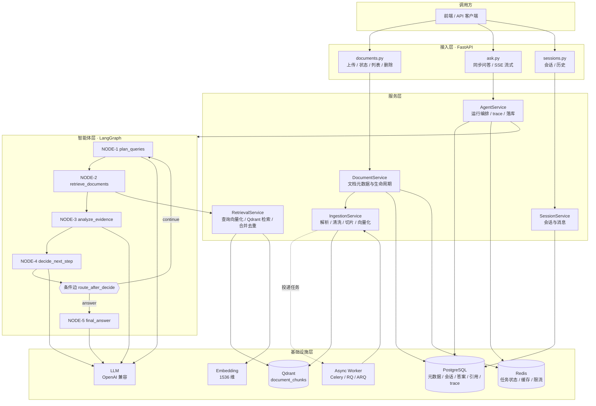
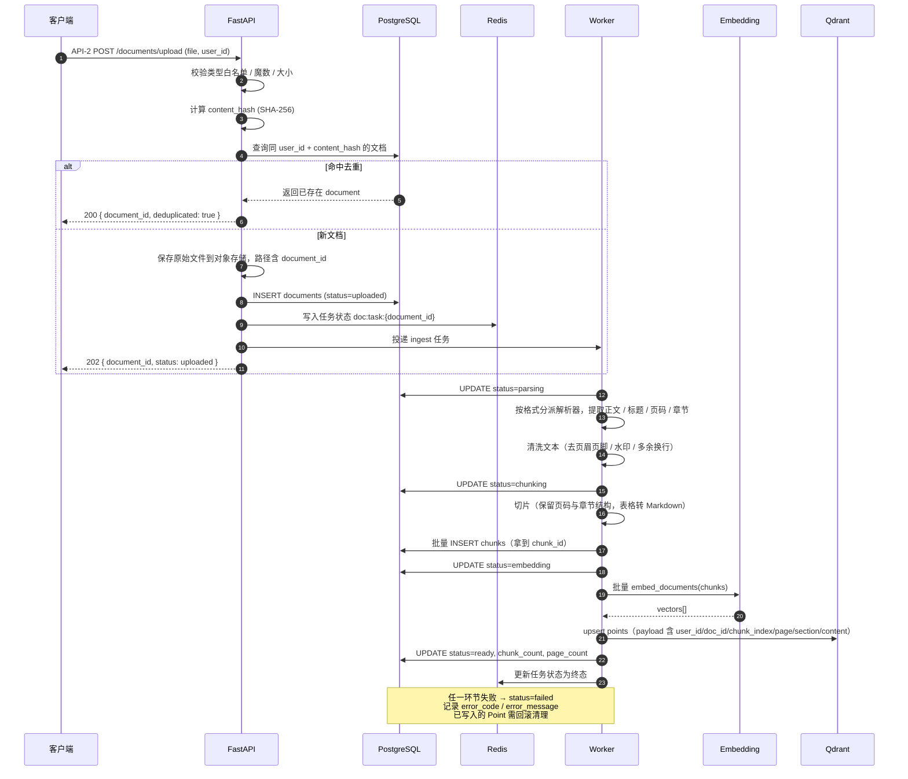
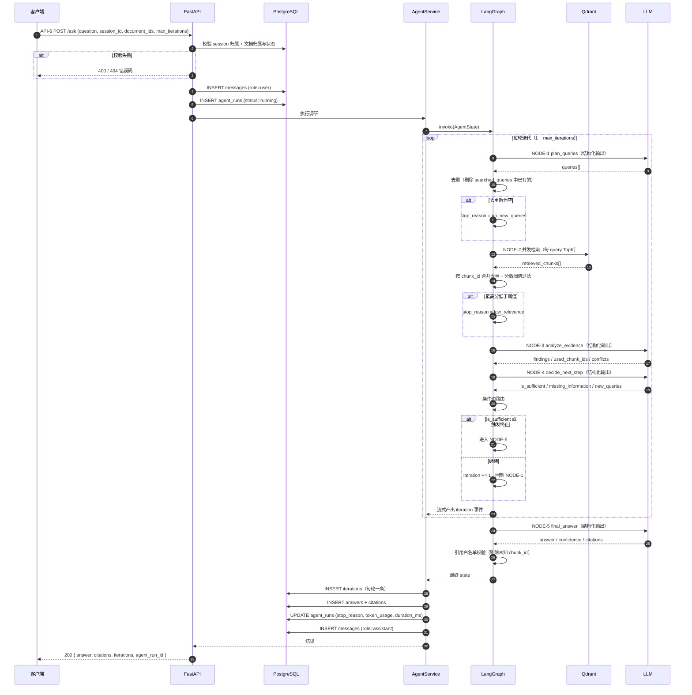
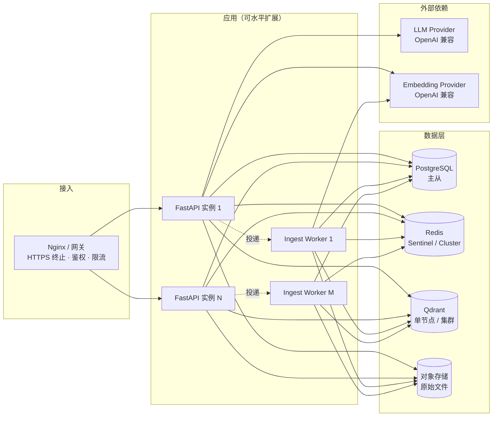

# 02 · 总体技术架构设计

| 项目 | 内容 |
| --- | --- |
| 文档版本 | v1.0 |
| 更新日期 | 2026-09-04 |
| 上游文档 | [README](./README.md) · [01-prd.md](./01-prd.md) |
| 下游文档 | [03-agent-design.md](./03-agent-design.md) · [04-data-model.md](./04-data-model.md) · [05-api-spec.md](./05-api-spec.md) |

---

## 1. 架构总览

### 1.1 分层视图

系统自顶向下分为四层：**接入层 → 服务层 → 智能体层 → 基础设施层**。



### 1.2 层职责边界

| 层 | 职责 | 明确不做 |
| --- | --- | --- |
| 接入层 | HTTP 协议处理、参数校验、鉴权上下文提取、SSE 事件编码、统一异常转错误码 | 不含业务逻辑；不直接访问数据库 |
| 服务层 | 业务用例编排、事务边界、DTO 转换、缓存与限流、任务投递 | 不含智能体循环逻辑 |
| 智能体层 | LangGraph 状态机定义、节点实现、终止判断、Prompt 组织 | 不含 HTTP 概念；不感知请求/响应模型 |
| 基础设施层 | 数据持久化、外部模型调用、向量检索 | 不含业务规则 |

**关键约束**：智能体层只依赖 `RetrievalService` 与 `LLM` 两个抽象接口，不直接依赖 Qdrant / OpenAI SDK。这保证状态机可在无外部依赖的情况下被完整单测（见 [03-agent-design.md §11 可测试性设计](./03-agent-design.md#11-可测试性设计)）。

---

## 2. 两条主流程

### 2.1 流程一：文档入库（Ingestion）



**流程要点**

1. **上传接口只做轻量工作**：落元数据、存文件、投递任务，必须在 1 秒内返回（NFR-1.1）。
2. **状态双写**：Redis 存任务状态供高频轮询（快），PostgreSQL 存权威状态（准）。二者不一致时以 PostgreSQL 为准，由补偿任务修复。
3. **先 PG 后 Qdrant**：`chunks` 记录先落 PostgreSQL 取得权威 `chunk_id`，再写 Qdrant。这样即使向量写入失败，`chunk_id` 依旧可追溯，便于补偿与清理。
4. **失败回滚**：`embedding` 或写入 Qdrant 失败时，需删除该 `doc_id` 在 Qdrant 中的残留 Point（幂等操作），避免「PG 显示 failed，Qdrant 却可检索」的不一致。
5. **切片带结构前缀**：每个 chunk 的文本包含结构上下文头，以提升 Embedding 质量：

   ```text
   【文档标题】2026 AI 行业报告
   【章节】3.2 行业风险
   【页码】5

   本项目可能面临数据合规风险。随着监管趋严……
   ```

   注意：结构头用于增强语义，但 `payload.content` 存**纯正文**，结构信息单独存 `payload.title` / `payload.section` / `payload.page`，避免污染引用展示。

### 2.2 流程二：智能问答调研（Ask）



**流程要点**

1. **准入校验前置**：所有归属与状态校验在图执行前完成，避免状态机内部处理权限问题。
2. **`agent_run` 先行创建**：即使后续失败也能留下 trace（对应 NFR-4.1）。
3. **终止判断内聚在图内**：`stop_reason` 由状态机产生，不由外层服务猜测。
4. **引用校验在图出口**：作为 `final_answer` 节点的收尾步骤，保证「出图的答案一定引用合法」。
5. **流式模式下事件实时推送**：使用 `graph.astream()` 在每个节点完成后产出事件，而非图跑完再一次性返回（对应 FR-9）。

---

## 3. 技术选型与权衡

### 3.1 选型表

| 层次 | 选型 | 版本要求 | 选型理由 |
| --- | --- | --- | --- |
| 语言 | Python | 3.11+ | AI 生态最完善；3.11 性能提升显著 |
| Web 框架 | FastAPI | 0.110+ | 原生异步、自动生成 OpenAPI、SSE 支持好 |
| Agent 编排 | **LangGraph** | 0.2+ | 显式状态机，支持条件边、持久化、流式，可控性优于 AgentExecutor |
| LLM 抽象 | LangChain Chat Model | 0.3+ | `with_structured_output` 统一结构化输出；多供应商兼容 |
| 向量库 | **Qdrant** | 1.9+ | 原生过滤能力强、payload 索引完善、支持命名向量与混合检索扩展 |
| 关系库 | **PostgreSQL** | 15+ | 事务可靠；JSONB 存灵活字段；全文检索可作为后续补充 |
| ORM | SQLAlchemy + Alembic | 2.x | 异步支持、迁移可控 |
| 缓存 / 队列 | **Redis** | 7+ | 任务状态、Embedding 缓存、限流、幂等锁 |
| 异步任务 | Celery / RQ / ARQ | — | 文档处理耗时且需重试；MVP 可用 FastAPI BackgroundTasks，生产必须独立 worker |
| Embedding | `text-embedding-3-small` | — | 1536 维，性价比高 |
| LLM | OpenAI 兼容端点 | — | 通过 `LLM_BASE_URL` 可切换 vLLM / DeepSeek / Qwen 等（留空回退 `OPENAI_BASE_URL`） |
| 文档解析 | PyMuPDF / python-docx / Unstructured / Trafilatura | — | 按格式分派，PDF 优先 PyMuPDF（快且保留页码） |
| 流式 | SSE (`text/event-stream`) | — | 比 WebSocket 简单，天然支持断线重连；本场景只需单向推送 |
| 观测 | OpenTelemetry + LangSmith/Phoenix | — | Trace LLM 调用链与 Token 消耗 |

### 3.2 关键权衡记录

#### 权衡一：LangGraph Graph API vs AgentExecutor

| 方案 | 优点 | 缺点 | 结论 |
| --- | --- | --- | --- |
| **LangGraph Graph API** | 状态流转显式可绘图；条件边精确表达「决策 → 回环」；支持 checkpoint 持久化与中断恢复；节点可独立单测；可流式产出中间状态 | 需手写状态定义与路由函数，样板代码略多 | **采用** |
| AgentExecutor | 上手快，工具调用自动循环 | 控制流黑盒，难以插入「充分性判断」这类自定义决策；难以保证轮次上限与中间状态可观测 | 不采用 |
| 手写 while 循环 | 无框架依赖，最直观 | 无持久化、无流式、无可视化；重试与并发需自行实现；后期迁移成本高 | 不作为最终形态 |

**决策依据**：本系统的核心复杂度集中在「循环控制与终止判断」，正是 Graph API 的强项。多写的样板代码换来的是可测试、可观测、可回放。

#### 权衡二：结构化输出 vs 正则/JSON 解析

| 方案 | 稳定性 | 结论 |
| --- | --- | --- |
| `with_structured_output`（Pydantic 模型） | 高，由模型供应商保证 JSON Schema 约束 | **采用** |
| Prompt 要求输出 JSON + 手工解析 | 低，格式漂移频繁 | 仅作为降级兜底 |

**配套要求**：必须定义解析失败的降级路径，见 [AG-4.1 ~ AG-4.5](./03-agent-design.md#8-结构化输出的降级策略)。

#### 权衡三：Dense 检索 vs 混合检索

| 方案 | 关键词命中 | 语义召回 | 复杂度 | 结论 |
| --- | --- | --- | --- | --- |
| 纯 Dense | 弱（对专有名词、编号、条款号不敏感） | 强 | 低 | **MVP 采用** |
| Dense + Sparse(BM25) + RRF | 强 | 强 | 中 | 阶段三引入 |
| Dense + Rerank | 中 | 强，且精排后更准 | 中 | 阶段三引入 |

**决策依据**：MVP 应先验证「多轮调研」这一核心差异化的收益，避免同时引入多个变量导致效果归因困难。混合检索的接入位已在 [AG-1.9 / AG-1.10](./03-agent-design.md#62-检索策略与召回参数) 预留。

#### 权衡四：同步入库 vs 异步入库

| 方案 | 响应 | 可靠性 | 结论 |
| --- | --- | --- | --- |
| 同步处理 | 慢（100 页 PDF 可能耗时数十秒） | 失败即时可见 | 不采用 |
| **异步 worker** | 快（< 1s 返回） | 需状态机与重试 | **采用** |

#### 权衡五：状态存储在 Redis vs PostgreSQL

采用**双写而非二选一**：Redis 承接高频轮询（QPS 高、可过期），PostgreSQL 作为权威源（持久、可查询、可关联）。理由见 [04-data-model.md §5](./04-data-model.md#5-数据流转与一致性策略)。

---

## 4. 部署视图

### 4.1 组件拓扑



### 4.2 扩展策略

| 组件 | 瓶颈 | 扩展方式 |
| --- | --- | --- |
| FastAPI | 并发请求、SSE 长连接 | 无状态，水平扩展；注意 SSE 连接数对内存的占用 |
| Ingest Worker | CPU（解析）+ IO（Embedding 调用） | 按队列长度扩缩容；解析与向量化可拆分为两个队列分别扩容 |
| PostgreSQL | 写入（chunk 批量插入）、查询 | 主从分离；`chunks` 表按 `doc_id` 分区；历史会话归档 |
| Redis | 内存 | Cluster 分片；任务状态设 TTL 自动过期 |
| Qdrant | 向量检索与存储 | 分片 + 副本；payload 索引必须建立，否则过滤退化为全表扫描 |

### 4.3 环境划分

| 环境 | 用途 | 数据隔离 |
| --- | --- | --- |
| `dev` | 本地开发 | 本地 Docker Compose |
| `test` | 自动化与回归 | 独立实例，评测集固定 |
| `staging` | 预发验证 | 独立实例，数据脱敏 |
| `prod` | 生产 | 独立实例，备份与监控完备 |

---

## 5. 配置与环境变量清单

所有配置通过环境变量注入，禁止硬编码。密钥类配置禁止进入代码库（NFR-3.6）。

### 5.1 LLM 与 Embedding

| 变量 | 说明 | 默认值 | 必填 |
| --- | --- | --- | --- |
| `OPENAI_API_KEY` | **通用兜底** API Key，专用变量留空时生效 | — | 是 |
| `OPENAI_BASE_URL` | **通用兜底** 端点，专用变量留空时生效 | `https://api.openai.com/v1` | 否 |
| `LLM_BASE_URL` | LLM 专用端点，留空回退到 `OPENAI_BASE_URL` | 空 | 否 |
| `LLM_API_KEY` | LLM 专用 Key，留空回退到 `OPENAI_API_KEY` | 空 | 否 |
| `EMBEDDING_BASE_URL` | Embedding 专用端点，留空回退到 `OPENAI_BASE_URL` | 空 | 否 |
| `EMBEDDING_API_KEY` | Embedding 专用 Key，留空回退到 `OPENAI_API_KEY` | 空 | 否 |
| `LLM_MODEL` | 主模型名称 | `gpt-4o-mini` | 是 |
| `LLM_FALLBACK_MODEL` | 降级模型（结构化输出失败时使用） | 同 `LLM_MODEL` | 否 |
| `LLM_TEMPERATURE` | 生成温度，决策类节点建议 0 | `0` | 否 |
| `LLM_TIMEOUT_SECONDS` | 单次调用超时 | `60` | 否 |
| `LLM_MAX_RETRIES` | 最大重试次数 | `3` | 否 |
| `EMBEDDING_MODEL` | Embedding 模型 | `text-embedding-3-small` | 是 |
| `EMBEDDING_DIM` | 向量维度，必须与模型一致 | `1536` | 是 |
| `EMBEDDING_BATCH_SIZE` | 批量向量化的批大小 | `64` | 否 |

> **重要**：`EMBEDDING_DIM` 变更会导致 Qdrant Collection 不兼容。变更流程见 [04-data-model.md §6](./04-data-model.md#6-容量估算与维度变更)。

#### 5.1.1 LLM 与 Embedding 的端点必须可独立配置

LLM 与 Embedding 虽然都走 OpenAI 兼容接口，但**实际部署中常来自不同的服务**（例如大模型用 OpenAI、Embedding 用本地 TEI 或自建 vLLM）。若二者共用一个 `OPENAI_BASE_URL`，切换其中一侧会「误伤」另一侧。

因此采用**专用变量 + 通用兜底**的两级配置：

```text
LLM 实际端点       = LLM_BASE_URL       or OPENAI_BASE_URL
Embedding 实际端点 = EMBEDDING_BASE_URL or OPENAI_BASE_URL
LLM 实际 Key       = LLM_API_KEY        or OPENAI_API_KEY
Embedding 实际 Key = EMBEDDING_API_KEY  or OPENAI_API_KEY
```

| 约束 | 说明 |
| --- | --- |
| AG-7.1 | `LLMService` 与 `EmbeddingService` 必须分别构造独立的客户端实例（`ChatOpenAI` 与 `OpenAIEmbeddings`），各自使用解析后的端点与 Key，**禁止**共享同一 client |
| AG-7.2 | 解析规则为「专用变量优先，留空回退通用」；空字符串视同留空 |
| AG-7.3 | 应用启动时需打印解析后的**脱敏**端点（仅协议 + 主机 + 端口，不含 Key 与路径参数），便于排查「指错了服务」这类问题 |
| AG-7.4 | 启动时分别对 LLM 与 Embedding 端点做一次轻量探测（`GET /models`），失败时给出明确错误并指明是哪个端点不可达（错误码 `5032001`） |
| AG-7.5 | 禁止把 `OPENAI_BASE_URL` 或 `LLM_BASE_URL` 指向仅实现 embeddings 的服务（如 TEI）——此类服务没有 `/v1/chat/completions`，会导致全部大模型调用失败 |

#### 5.1.2 本地 Embedding 可选方案（TEI）

开发阶段若需离线运行或节省 Embedding API 费用，可启用 `docker-compose.yml` 中的 **TEI（text-embeddings-inference）** 服务（默认不启动，需 `--profile local-emb`）。

| 项 | 说明 |
| --- | --- |
| 默认模型 | `BAAI/bge-m3`，dense 维度 **1024** |
| 端口 | 宿主 `8080` → 容器 `80`（TEI 容器内监听 80） |
| 镜像 | CPU 环境用 `cpu-1.9`；有 NVIDIA GPU 时用不带 `cpu-` 前缀的 `1.9` |
| 提供的端点 | `/embed`、`/rerank`、`/predict`、`/embed_sparse`、`/v1/embeddings`（OpenAI 兼容） |
| **不提供** | `/v1/chat/completions` —— 因此 **TEI 不能作为 LLM 端点** |

**启用 TEI 的正确配置**（四处，缺一不可）：

```bash
EMBEDDING_BASE_URL=http://localhost:8080/v1   # 只改专用变量
EMBEDDING_MODEL=BAAI/bge-m3
EMBEDDING_DIM=1024                            # bge-m3 是 1024 维
QDRANT_COLLECTION=document_chunks_bgem3       # 必须换一个新 Collection
```

`OPENAI_BASE_URL` 与 `LLM_BASE_URL` **保持指向大模型服务不动**。

> **维度冲突警告**：默认方案 `text-embedding-3-small` 为 **1536 维**，与 bge-m3 的 1024 维**禁止**写入同一个 Qdrant Collection，否则检索直接报错。迁移流程见 [04-data-model.md §6.3](./04-data-model.md#63-embedding-维度变更流程)。
>
> **端点警告**：切勿将 `OPENAI_BASE_URL` 或 `LLM_BASE_URL` 指向 TEI。TEI 只实现 embeddings，指向它会使「查询规划 / 证据分析 / 充分性判断 / 生成答案」四个节点的 LLM 调用全部失败（违反 [AG-7.5](#511-llm-与-embedding-的端点必须可独立配置)）。

### 5.2 存储

| 变量 | 说明 | 默认值 | 必填 |
| --- | --- | --- | --- |
| `POSTGRES_DSN` | PostgreSQL 连接串 | — | 是 |
| `POSTGRES_POOL_SIZE` | 连接池大小 | `20` | 否 |
| `REDIS_URL` | Redis 连接串 | — | 是 |
| `QDRANT_URL` | Qdrant 地址 | `http://localhost:6333` | 是 |
| `QDRANT_API_KEY` | Qdrant API Key（云部署时） | — | 否 |
| `QDRANT_COLLECTION` | Collection 名称 | `document_chunks` | 否 |
| `STORAGE_BACKEND` | 原始文件存储后端 | `local` | 否 |
| `STORAGE_PATH` | 本地存储路径 | `./data/files` | 否 |

### 5.3 智能体与检索

| 变量 | 说明 | 默认值 | 关联 |
| --- | --- | --- | --- |
| `AGENT_MAX_ITERATIONS` | 默认最大迭代轮次 | `3`（MVP）/ `5`（生产） | [AG-2.1](./03-agent-design.md#5-终止策略与-stop_reason) |
| `AGENT_MAX_QUERIES_PER_ROUND` | 每轮最多生成查询数 | `3` | [NODE-1](./03-agent-design.md#31-node-1-plan_queries) |
| `AGENT_TOP_K_PER_QUERY` | 每条查询召回条数 | `10` | [AG-1.5](./03-agent-design.md#62-检索策略与召回参数) |
| `AGENT_SCORE_THRESHOLD` | 检索分数阈值，低于此值判定 `low_relevance` | `0.35` | [AG-2.4](./03-agent-design.md#5-终止策略与-stop_reason) |
| `AGENT_MAX_EVIDENCE_PER_ROUND` | 每轮送入 LLM 的最大证据条数 | `12` | [AG-1.16](./03-agent-design.md#64-token-预算与上下文裁剪) |
| `AGENT_MAX_CHUNK_CHARS` | 单条证据送入 LLM 的最大字符数 | `1500` | [AG-1.17](./03-agent-design.md#64-token-预算与上下文裁剪) |
| `AGENT_TOKEN_BUDGET` | 单次 `agent_run` 的 Token 预算 | `60000` | [AG-2.5](./03-agent-design.md#5-终止策略与-stop_reason) |
| `AGENT_TIMEOUT_SECONDS` | 单次 `agent_run` 总耗时上限 | `120` | [AG-2.6](./03-agent-design.md#5-终止策略与-stop_reason) |
| `AGENT_NO_NEW_EVIDENCE_ROUNDS` | 连续无新增证据的轮次阈值 | `1` | [AG-2.3](./03-agent-design.md#5-终止策略与-stop_reason) |

### 5.4 文档处理

| 变量 | 说明 | 默认值 |
| --- | --- | --- |
| `DOC_MAX_FILE_SIZE_MB` | 单文件大小上限 | `50` |
| `DOC_ALLOWED_EXTENSIONS` | 扩展名白名单（逗号分隔） | `pdf,md,txt`（MVP）/ `pdf,docx,md,txt,html`（生产） |
| `CHUNK_SIZE_TOKENS` | 切片目标大小 | `600` |
| `CHUNK_OVERLAP_TOKENS` | 切片重叠 | `80` |
| `INGEST_MAX_RETRIES` | 入库任务最大重试 | `3` |
| `INGEST_TASK_TTL_SECONDS` | Redis 任务状态 TTL | `86400` |

### 5.5 服务与观测

| 变量 | 说明 | 默认值 |
| --- | --- | --- |
| `APP_ENV` | 环境标识 | `dev` |
| `LOG_LEVEL` | 日志级别 | `INFO` |
| `LOG_FORMAT` | 日志格式 | `json` |
| `RATE_LIMIT_ASK_PER_MINUTE` | 单用户问答限流 | `20` |
| `RATE_LIMIT_UPLOAD_PER_MINUTE` | 单用户上传限流 | `10` |
| `OTEL_EXPORTER_OTLP_ENDPOINT` | OpenTelemetry 导出端点 | — |
| `LANGSMITH_API_KEY` | LangSmith Trace（可选） | — |

---

## 6. 目标工程目录结构

```text
alethix/
├── app/
│   ├── main.py                     # FastAPI 应用入口、生命周期、全局异常处理
│   ├── api/
│   │   ├── deps.py                 # 依赖注入（会话上下文、服务实例、限流）
│   │   ├── sessions.py             # API-1 / API-8
│   │   ├── documents.py            # API-2 / API-3 / API-4 / API-5
│   │   └── ask.py                  # API-6 / API-7 (SSE)
│   ├── core/
│   │   ├── config.py               # 环境变量与配置模型（pydantic-settings）
│   │   ├── logging.py              # 结构化日志
│   │   ├── errors.py               # 统一异常与错误码
│   │   └── security.py             # 文件校验、Prompt 注入防护工具
│   ├── services/
│   │   ├── document_service.py     # 文档元数据与生命周期
│   │   ├── ingestion_service.py    # 解析 / 清洗 / 切片 / 向量化
│   │   ├── parser_service.py       # 格式分派与解析器
│   │   ├── chunk_service.py        # 切片策略
│   │   ├── embedding_service.py    # Embedding 封装与缓存
│   │   ├── retrieval_service.py    # 查询向量化 / Qdrant 检索 / 合并去重
│   │   ├── qdrant_service.py       # Qdrant 客户端与 Collection 管理
│   │   ├── llm_service.py          # LLM 封装与结构化输出
│   │   ├── agent_service.py        # agent_run 编排、trace、落库
│   │   └── session_service.py      # 会话与消息
│   ├── agents/
│   │   ├── state.py                # AgentState 定义
│   │   ├── schemas.py              # 四个节点的 Pydantic 输出模型
│   │   ├── prompts.py              # 四套 Prompt 模板
│   │   ├── nodes.py                # 五个节点实现
│   │   ├── routing.py              # 条件边路由与终止判断
│   │   └── graph.py                # StateGraph 组装与编译
│   ├── models/                     # SQLAlchemy ORM 模型
│   │   ├── document.py             # DM-2 / DM-3
│   │   ├── session.py              # DM-4 / DM-5
│   │   └── agent.py                # DM-6 / DM-7 / DM-8 / DM-9
│   ├── schemas/                    # API 层 Pydantic DTO
│   │   ├── document.py
│   │   ├── ask.py
│   │   └── common.py
│   └── db/
│       ├── postgres.py             # 引擎与会话
│       └── redis.py                # Redis 客户端
├── workers/
│   ├── ingest_worker.py            # 文档入库任务
│   └── cleanup_worker.py           # 删除清理与一致性补偿
├── migrations/                     # Alembic 迁移脚本
├── scripts/
│   ├── init_qdrant.py              # 初始化 Collection 与 payload 索引
│   └── eval_runner.py              # 评测集批量跑分
├── tests/
│   ├── unit/
│   │   ├── test_chunk_service.py
│   │   ├── test_retrieval_service.py
│   │   ├── test_agent_nodes.py     # 各节点独立单测
│   │   └── test_routing.py         # 终止策略单测
│   ├── integration/
│   │   ├── test_ingestion_flow.py
│   │   └── test_ask_flow.py
│   └── eval/
│       ├── questions.jsonl         # 评测集
│       └── test_answer_quality.py
├── data/
│   └── files/                      # 原始文件（生产应改为对象存储）
├── web/                            # 前端工程（React 19 + Vite 8 + TS 7 + AntD 6 + Tailwind 4）
├── prd/                            # 本文档集
├── .env.example
├── docker-compose.yml
├── pyproject.toml                  # 依赖声明（uv 管理）
└── uv.lock                         # 锁定版本，需提交以保证可复现
```

> **依赖管理**：后端使用 **uv + `pyproject.toml`**（不再使用 `requirements.txt`）。
> `uv.lock` 必须提交到版本库；安装依赖用 `uv sync`，运行命令用 `uv run <cmd>`。

---

## 7. 错误处理与重试策略

### 7.1 分层错误模型

| 层 | 错误表示 | 处理方式 |
| --- | --- | --- |
| 基础设施层 | SDK 原生异常 | 包装为领域异常向上抛 |
| 服务层 | 领域异常（如 `DocumentNotFoundError`） | 携带错误码与可读信息 |
| 接入层 | 统一错误响应 | 通过全局异常处理器转换为 HTTP 状态码 + 业务错误码（见 [05-api-spec.md §5](./05-api-spec.md#5-错误码表)） |
| 智能体层 | 不抛异常 | 节点内部捕获并降级，状态置 `failed` / `stop_reason=internal_error` |

### 7.2 重试策略

| 场景 | 策略 | 备注 |
| --- | --- | --- |
| LLM 调用 | 最多 3 次，指数退避 1s / 2s / 4s，加抖动 | 仅对 `5xx`、`RateLimit`、`Timeout` 重试；`4xx` 参数错误不重试 |
| Embedding 调用 | 最多 3 次，指数退避 | 同上 |
| Qdrant 检索 | 最多 2 次，退避 0.5s | 检索失败可降级为「本轮无新证据」并继续 |
| 文档入库任务 | 最多 3 次，退避 30s / 120s / 300s | 超过则 `failed`，需人工介入 |
| 数据库写入 | 最多 2 次 | 唯一约束冲突不重试 |

### 7.3 幂等性设计

| 操作 | 幂等键 | 机制 |
| --- | --- | --- |
| 文档上传 | `user_id + content_hash` | 唯一索引，命中返回已有 `document_id` |
| 文档入库任务 | `document_id` | Redis 分布式锁 `doc:lock:{document_id}`，防止重复消费 |
| 问答请求 | 客户端传入 `Idempotency-Key`（可选） | Redis 记录 `idem:{key}`，命中则返回原结果 |
| Qdrant upsert | `chunk_id` 作为 Point ID | 天然幂等，重复写入覆盖 |

---

## 8. 可观测性设计

### 8.1 三大支柱

| 支柱 | 实现 | 关键内容 |
| --- | --- | --- |
| **日志** | 结构化 JSON 日志 | `trace_id`、`user_id`、`agent_run_id`、`document_id`、节点名、耗时；禁止记录文档正文与密钥 |
| **指标** | Prometheus 指标 | 见下表 |
| **链路** | OpenTelemetry + LangSmith | 每次 `agent_run` 一条 trace，每个节点一个 span，记录 LLM 调用的 Token 数 |

### 8.2 核心指标

| 指标名 | 类型 | 说明 | 告警阈值 |
| --- | --- | --- | --- |
| `ask_requests_total` | Counter | 问答请求数（按 `stop_reason` 打标） | — |
| `ask_duration_seconds` | Histogram | 端到端耗时 | P95 > 25s |
| `agent_iterations` | Histogram | 迭代轮次分布 | 均值 > 4 |
| `agent_stop_reason_total` | Counter | 终止原因分布 | `internal_error` 占比 > 1% |
| `retrieval_duration_seconds` | Histogram | 单轮检索耗时 | P95 > 800ms |
| `retrieval_chunks_total` | Histogram | 单轮召回条数 | 均值 < 3（可能阈值过严） |
| `llm_calls_total` | Counter | LLM 调用次数（按节点打标） | — |
| `llm_tokens_total` | Counter | Token 消耗（按 prompt/completion 打标） | 单用户日消耗异常增长 |
| `llm_call_duration_seconds` | Histogram | LLM 调用耗时 | P95 > 30s |
| `document_ingest_duration_seconds` | Histogram | 文档入库耗时 | P95 > 60s/100页 |
| `document_status_total` | Counter | 文档状态分布 | `failed` 占比 > 5% |
| `citation_count` | Histogram | 单次答案引用数 | 均值为 0（引用机制失效） |

### 8.3 Trace 结构

每次 `agent_run` 生成一条完整 trace：

```text
agent_run (trace)
├── iteration_1 (span)
│   ├── plan_queries (span)      → llm_call (span, tokens: 320/48)
│   ├── retrieve_documents (span)
│   │   ├── embed_query ×3 (span)
│   │   └── qdrant_search ×3 (span)
│   ├── analyze_evidence (span)  → llm_call (span, tokens: 2400/310)
│   └── decide_next_step (span)  → llm_call (span, tokens: 980/120)
├── iteration_2 (span)
│   └── ...
└── final_answer (span)          → llm_call (span, tokens: 3100/520)
```

`trace` 需关联的持久化字段见 [DM-6 agent_runs](./04-data-model.md#dm-6-agent_runs)。

---

## 9. 架构决策记录（ADR 摘要）

| 编号 | 决策 | 状态 | 影响 |
| --- | --- | --- | --- |
| ADR-1 | 采用 LangGraph Graph API 作为编排框架 | 已确认 | 状态机可测、可观测、可持久化 |
| ADR-2 | 四节点 LLM 调用全部使用结构化输出 | 已确认 | 契约稳定；需配套降级策略 |
| ADR-3 | 采用 PostgreSQL + Redis + Qdrant 三存储 | 已确认 | 职责清晰；需处理跨存储一致性 |
| ADR-4 | 文档入库异步化 | 已确认 | 需状态机与补偿任务 |
| ADR-5 | MVP 采用纯 Dense 检索 | 已确认 | 阶段三引入 Rerank 与混合检索 |
| ADR-6 | Embedding 维度 1536（`text-embedding-3-small`） | 已确认 | 变更需 Collection 版本化迁移 |
| ADR-7 | 引用必须来自实际检索到的 `chunk_id` 白名单 | 已确认 | 牺牲部分答案丰富度，换取可核验性 |
| ADR-8 | 流式输出采用 SSE 而非 WebSocket | 已确认 | 单向推送足够；实现与运维更简单 |
| ADR-9 | 检索内容视为数据，不执行其中指令 | 已确认 | 需在 Prompt 与片段包裹上落实（NFR-3.5） |
