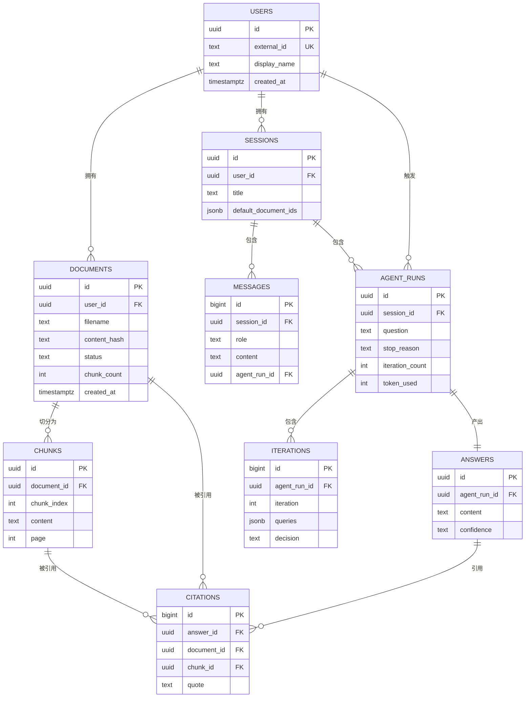

# 04 · 数据模型设计

| 项目 | 内容 |
| --- | --- |
| 文档版本 | v1.0 |
| 更新日期 | 2026-09-04 |
| 上游文档 | [README](./README.md) · [01-prd.md](./01-prd.md) · [02-architecture.md](./02-architecture.md) |
| 关联文档 | [03-agent-design.md](./03-agent-design.md) · [05-api-spec.md](./05-api-spec.md) |

---

## 1. 数据架构总览

系统采用**三存储分工**：

| 存储 | 角色 | 存什么 | 特征 |
| --- | --- | --- | --- |
| **PostgreSQL** | 权威源（Source of Truth） | 元数据、会话、消息、调研轨迹、答案、引用 | 事务、可关联查询、可追溯 |
| **Qdrant** | 检索索引 | 切片向量 + 原文 + 过滤用元数据 | 可重建；数据由 PG 派生 |
| **Redis** | 临时态 | 任务状态、缓存、锁、限流、SSE 事件缓冲 | 可丢失；TTL 自动过期 |

### 1.1 分工原则

1. **PostgreSQL 是权威源**：Qdrant 中的数据视为 PostgreSQL `chunks` 表的**派生索引**，可随时由 PG 重建。任何写入以 PG 成功为准。
2. **Qdrant 只服务检索**：不把 Qdrant 当数据库用，不在其中存储业务状态。
3. **Redis 不存唯一数据**：Redis 中的一切都必须可从 PG 重建或可安全过期。

---

## 2. 实体关系



### 2.1 关于 ID 的设计修正（重要）

> **与草稿的差异说明**：草稿中的示例使用了 `doc_001`、`doc_001_chunk_00012` 这类可读 ID。本设计**不采用**该形式，全部对外 ID 改用 **UUID v4**，原因如下。

**Qdrant 的 Point ID 只接受两种类型**：64 位无符号整数，或**合法的 UUID 字符串**。`doc_001_chunk_00012` 不是合法 UUID，会被 Qdrant 拒绝。由于 `chunk_id` 必须同时作为 PostgreSQL 主键与 Qdrant Point ID 才能保证二者一一对应、引用可回跳，因此 `chunk_id` 必须是 UUID。

统一后的约定：

| 实体 | ID 类型 | 示例 |
| --- | --- | --- |
| `user_id` / `document_id` / `session_id` / `agent_run_id` / `chunk_id` / `answer_id` | UUID v4 字符串 | `9f2c1a8e-3b4d-4f6a-8c21-0e5d7a9b1c34` |
| `chunks.id` / `iterations.id` / `citations.id` / `messages.id` | UUID / BIGSERIAL（见各表定义） | — |

可读性损失通过**响应中携带 `filename` / `page` / `section`** 弥补——用户真正需要的是「来自《2026 AI 行业报告》第 5 页」，而非 `chunk_00012`。

---

## 3. PostgreSQL 数据模型

### 3.0 通用约定

| 约定 | 说明 |
| --- | --- |
| 主键 | 对外实体用 `uuid`（应用层用 `uuid4()` 生成，便于先生成后插入）；内部明细用 `BIGSERIAL` |
| 时间 | 全部 `TIMESTAMPTZ`，默认 `now()`，存储 UTC |
| 软删除 | 需要软删的表加 `deleted_at TIMESTAMPTZ NULL`，查询默认过滤 `deleted_at IS NULL` |
| 枚举 | 使用 `TEXT` + `CHECK` 约束（便于演进，避免 `ALTER TYPE` 的迁移成本） |
| JSON | 使用 `JSONB`（支持索引与查询） |
| 迁移 | Alembic，禁止手工改表 |

---

### DM-1 users

用户主体。MVP 阶段由网关鉴权后写入，`external_id` 为网关侧的用户标识。

```sql
CREATE TABLE users (
    id            UUID PRIMARY KEY,
    external_id   TEXT UNIQUE,                    -- 网关/IdP 侧的用户标识
    display_name  TEXT,
    quota_docs    INT NOT NULL DEFAULT 500,       -- 文档数配额（NFR 待确认项 Q-2）
    created_at    TIMESTAMPTZ NOT NULL DEFAULT now(),
    updated_at    TIMESTAMPTZ NOT NULL DEFAULT now()
);

CREATE INDEX idx_users_external_id ON users (external_id) WHERE external_id IS NOT NULL;
```

---

### DM-2 documents

文档主表，承载文档生命周期状态机（FR-1 ~ FR-3）。

```sql
CREATE TABLE documents (
    id               UUID PRIMARY KEY,
    user_id          UUID NOT NULL REFERENCES users (id) ON DELETE CASCADE,

    filename         TEXT NOT NULL,               -- 用户原始文件名（仅用于展示）
    content_hash     TEXT NOT NULL,               -- SHA-256，用于去重
    mime_type        TEXT NOT NULL,
    source_format    TEXT NOT NULL,               -- pdf / docx / md / txt / html
    file_size_bytes  BIGINT NOT NULL,
    storage_path     TEXT NOT NULL,               -- 原始文件存储路径

    title            TEXT,                        -- 从文档提取的标题

    status           TEXT NOT NULL DEFAULT 'uploaded'
        CHECK (status IN ('uploaded','parsing','chunking','embedding','ready','failed')),
    chunk_count      INT,
    page_count       INT,
    error_code       TEXT,
    error_message    TEXT,                        -- 用户可读，不含堆栈

    created_at       TIMESTAMPTZ NOT NULL DEFAULT now(),
    updated_at       TIMESTAMPTZ NOT NULL DEFAULT now(),
    ready_at         TIMESTAMPTZ,
    deleted_at       TIMESTAMPTZ
);

-- 去重：同一用户的同一内容只允许一条有效记录
CREATE UNIQUE INDEX uq_documents_user_content
    ON documents (user_id, content_hash)
    WHERE deleted_at IS NULL;

-- 列表查询：按用户 + 时间倒序 + 状态过滤
CREATE INDEX idx_documents_user_created
    ON documents (user_id, created_at DESC)
    WHERE deleted_at IS NULL;

CREATE INDEX idx_documents_status
    ON documents (status)
    WHERE deleted_at IS NULL;
```

**字段说明**

| 字段 | 说明 |
| --- | --- |
| `content_hash` | SHA-256。配合唯一索引实现上传幂等（FR-1 第 3 条、AC-1.5） |
| `status` | 状态机见 [README 术语表](./README.md#状态枚举速查) |
| `error_message` | 用户可读的失败原因，禁止包含堆栈与内部路径（NFR-3.7） |
| `deleted_at` | 软删标记；物理清理由 `cleanup_worker` 异步执行 |

---

### DM-3 chunks

文档切片。`id` 即 Qdrant 的 Point ID，二者必须一致。

```sql
CREATE TABLE chunks (
    id            UUID PRIMARY KEY,               -- 同时作为 Qdrant Point ID
    document_id   UUID NOT NULL REFERENCES documents (id) ON DELETE CASCADE,
    user_id       UUID NOT NULL REFERENCES users (id) ON DELETE CASCADE,

    chunk_index   INT NOT NULL,                   -- 文档内序号，从 0 开始
    content       TEXT NOT NULL,                  -- 纯正文（不含结构头）
    content_length INT NOT NULL,
    token_count   INT,

    page          INT,                            -- 起始页码
    section       TEXT,                           -- 所属章节标题

    created_at    TIMESTAMPTZ NOT NULL DEFAULT now()
);

CREATE UNIQUE INDEX uq_chunks_document_index ON chunks (document_id, chunk_index);
CREATE INDEX idx_chunks_document ON chunks (document_id);
CREATE INDEX idx_chunks_user ON chunks (user_id);
```

**设计要点**

| 要点 | 说明 |
| --- | --- |
| 冗余 `user_id` | 便于按用户级联删除与统计，避免每次关联 `documents` |
| `content` 存纯正文 | 结构头（标题/章节/页码）用于增强 Embedding，但**不**存进 `content`，避免污染引用展示。结构信息单独落在 `title` / `page` / `section` |
| `content_length` | 冗余字段，用于容量统计与超长切片监控 |
| 与 Qdrant 的一致性 | 见 §5 |

---

### DM-4 sessions

会话，作为连续问答的上下文容器（FR-4）。

```sql
CREATE TABLE sessions (
    id                   UUID PRIMARY KEY,
    user_id              UUID NOT NULL REFERENCES users (id) ON DELETE CASCADE,
    title                TEXT,
    default_document_ids JSONB NOT NULL DEFAULT '[]'::jsonb,  -- 会话默认检索范围
    message_count        INT NOT NULL DEFAULT 0,
    created_at           TIMESTAMPTZ NOT NULL DEFAULT now(),
    updated_at           TIMESTAMPTZ NOT NULL DEFAULT now(),
    expires_at           TIMESTAMPTZ,                          -- 默认 90 天后归档
    deleted_at           TIMESTAMPTZ
);

CREATE INDEX idx_sessions_user_updated
    ON sessions (user_id, updated_at DESC)
    WHERE deleted_at IS NULL;
```

---

### DM-5 messages

会话消息，一问一答各一条（FR-10）。

```sql
CREATE TABLE messages (
    id            BIGSERIAL PRIMARY KEY,
    session_id    UUID NOT NULL REFERENCES sessions (id) ON DELETE CASCADE,
    role          TEXT NOT NULL CHECK (role IN ('user','assistant')),
    content       TEXT NOT NULL,
    agent_run_id  UUID,                          -- assistant 消息关联的调研运行
    seq           INT NOT NULL,                  -- 会话内序号，用于稳定排序
    created_at    TIMESTAMPTZ NOT NULL DEFAULT now()
);

CREATE UNIQUE INDEX uq_messages_session_seq ON messages (session_id, seq);
CREATE INDEX idx_messages_session_created ON messages (session_id, created_at);
CREATE INDEX idx_messages_agent_run ON messages (agent_run_id) WHERE agent_run_id IS NOT NULL;
```

---

### DM-6 agent_runs

一次调研运行。承载可观测性与成本归因（NFR-4.1、NFR-5.2）。

```sql
CREATE TABLE agent_runs (
    id                 UUID PRIMARY KEY,
    session_id         UUID NOT NULL REFERENCES sessions (id) ON DELETE CASCADE,
    user_id            UUID NOT NULL REFERENCES users (id) ON DELETE CASCADE,
    message_id         BIGINT REFERENCES messages (id) ON DELETE SET NULL,

    question           TEXT NOT NULL,
    document_ids       JSONB NOT NULL DEFAULT '[]'::jsonb,   -- 空数组表示用户全部文档
    max_iterations     INT NOT NULL DEFAULT 3,

    status             TEXT NOT NULL DEFAULT 'running'
        CHECK (status IN ('running','done','failed')),
    stop_reason        TEXT
        CHECK (stop_reason IN (
            'sufficient','max_iterations_reached','no_new_queries',
            'no_new_evidence','low_relevance','budget_exceeded','internal_error')),

    iteration_count    INT NOT NULL DEFAULT 0,
    retrieved_chunk_count INT NOT NULL DEFAULT 0,
    citation_count     INT NOT NULL DEFAULT 0,
    citation_filtered_count INT NOT NULL DEFAULT 0,          -- 被引用校验剔除的数量（AG-1.22）

    prompt_tokens      INT NOT NULL DEFAULT 0,
    completion_tokens  INT NOT NULL DEFAULT 0,
    token_used         INT NOT NULL DEFAULT 0,

    llm_call_count     INT NOT NULL DEFAULT 0,
    fallback_count     INT NOT NULL DEFAULT 0,               -- 结构化输出降级次数（AG-4.5）

    duration_ms        INT,
    started_at         TIMESTAMPTZ NOT NULL DEFAULT now(),
    finished_at        TIMESTAMPTZ,
    created_at         TIMESTAMPTZ NOT NULL DEFAULT now(),

    error_code         TEXT,
    error_message      TEXT
);

CREATE INDEX idx_agent_runs_user_created ON agent_runs (user_id, created_at DESC);
CREATE INDEX idx_agent_runs_session ON agent_runs (session_id, created_at);
CREATE INDEX idx_agent_runs_stop_reason ON agent_runs (stop_reason, created_at DESC);
```

**字段说明**

| 字段 | 用途 |
| --- | --- |
| `citation_filtered_count` | 监控模型幻觉倾向。持续增长说明 Prompt 或模型需要调整（AG-1.22） |
| `fallback_count` | 监控结构化输出稳定性（AG-4.5） |
| `stop_reason` | 终止原因分布是指标 `agent_stop_reason_total` 的数据来源 |
| `token_used` | 成本归因（NFR-5.2） |

---

### DM-7 iterations

单轮迭代记录（FR-6、FR-9）。

```sql
CREATE TABLE iterations (
    id                    BIGSERIAL PRIMARY KEY,
    agent_run_id          UUID NOT NULL REFERENCES agent_runs (id) ON DELETE CASCADE,

    iteration             INT NOT NULL,
    queries               JSONB NOT NULL DEFAULT '[]'::jsonb,   -- 本轮检索查询
    retrieved_chunk_count INT NOT NULL DEFAULT 0,
    new_chunk_count       INT NOT NULL DEFAULT 0,               -- 相对历史的新增切片数
    max_score             REAL,                                 -- 本轮最高检索分
    findings              JSONB NOT NULL DEFAULT '[]'::jsonb,
    conflicts             JSONB NOT NULL DEFAULT '[]'::jsonb,
    decision              TEXT NOT NULL CHECK (decision IN ('continue','answer')),
    reason                TEXT,
    missing_information   TEXT,

    created_at            TIMESTAMPTZ NOT NULL DEFAULT now()
);

CREATE UNIQUE INDEX uq_iterations_run_index ON iterations (agent_run_id, iteration);
```

---

### DM-8 answers

最终答案。与 `agent_runs` 逻辑上 1:1，独立成表以便未来支持「一次运行多个候选答案」。

```sql
CREATE TABLE answers (
    id            UUID PRIMARY KEY,
    agent_run_id  UUID NOT NULL UNIQUE REFERENCES agent_runs (id) ON DELETE CASCADE,
    session_id    UUID NOT NULL REFERENCES sessions (id) ON DELETE CASCADE,

    content       TEXT NOT NULL,
    confidence    TEXT NOT NULL CHECK (confidence IN ('high','medium','low')),
    stop_reason   TEXT,

    created_at    TIMESTAMPTZ NOT NULL DEFAULT now()
);

CREATE INDEX idx_answers_session ON answers (session_id, created_at);
```

---

### DM-9 citations

答案引用（FR-7）。

```sql
CREATE TABLE citations (
    id            BIGSERIAL PRIMARY KEY,
    answer_id     UUID NOT NULL REFERENCES answers (id) ON DELETE CASCADE,
    agent_run_id  UUID NOT NULL REFERENCES agent_runs (id) ON DELETE CASCADE,
    document_id   UUID NOT NULL REFERENCES documents (id) ON DELETE CASCADE,
    chunk_id      UUID NOT NULL REFERENCES chunks (id) ON DELETE CASCADE,

    filename      TEXT NOT NULL,
    page          INT,
    section       TEXT,
    quote         TEXT NOT NULL,                 -- 原文摘录，逐字一致（AG-1.23）
    ordinal       INT NOT NULL,                  -- 在答案中的出现顺序
    score         REAL,                          -- 检索分，用于排序与质量分析

    created_at    TIMESTAMPTZ NOT NULL DEFAULT now()
);

CREATE INDEX idx_citations_answer ON citations (answer_id, ordinal);
CREATE INDEX idx_citations_chunk ON citations (chunk_id);
CREATE INDEX idx_citations_document ON citations (document_id);
```

**约束**

| 约束 | 说明 |
| --- | --- |
| `quote` 来源 | 由服务层按 `chunk_id` 从 `chunks.content` 截取，**不信任**模型生成的摘录（AG-1.23） |
| `chunk_id` 外键 | 保证引用必然指向存在的切片，数据库层面兜住引用完整性 |
| `ordinal` | 保证引用顺序稳定，前端展示不抖动 |

---

## 4. Qdrant 数据模型

### 4.1 Collection 定义

```python
from qdrant_client import QdrantClient
from qdrant_client.models import Distance, VectorParams, HnswConfigDiff

client = QdrantClient(url=QDRANT_URL, api_key=QDRANT_API_KEY)

client.create_collection(
    collection_name="document_chunks",
    vectors_config={
        "dense": VectorParams(size=1536, distance=Distance.COSINE)
    },
    hnsw_config=HnswConfigDiff(
        m=16,                # 每个节点的连接数，召回与内存的权衡
        ef_construct=100,    # 构建时的候选集大小，越大越准但建索引越慢
        full_scan_threshold=10000,  # 低于此规模时全扫描比 HNSW 更快
    ),
)
```

| 参数 | 值 | 说明 |
| --- | --- | --- |
| `collection_name` | `document_chunks` | 可通过 `QDRANT_COLLECTION` 覆盖 |
| 向量名 | `dense` | 命名向量，为未来加入 `sparse` 预留（AG-1.10） |
| `size` | `1536` | 必须与 `EMBEDDING_DIM`、`text-embedding-3-small` 一致 |
| `distance` | `COSINE` | Embedding 已归一化时等价于点积；COSINE 更直观 |
| `m` | `16` | 通用推荐值 |
| `ef_construct` | `100` | 数据量 < 100 万时的推荐值 |

**检索时的 `ef` 参数**（`search_params`）建议设为 `64`~`128`，越大召回越全、延迟越高。

### 4.2 Payload 设计

每个 chunk 对应一个 Point，Point ID 即 `chunks.id`（UUID）。

```python
from qdrant_client.models import PointStruct

PointStruct(
    id=chunk_id,                      # UUID 字符串，与 PG chunks.id 一致
    vector={"dense": embedding},      # 1536 维
    payload={
        "user_id":      "9f2c1a8e-3b4d-4f6a-8c21-0e5d7a9b1c34",
        "doc_id":       "3a71b0c2-5e6f-4a8b-9c1d-2e3f4a5b6c7d",
        "filename":     "2026_ai_report.pdf",
        "title":        "2026 AI 行业报告",
        "chunk_id":     "b1e2d3c4-5f6a-7b8c-9d0e-1f2a3b4c5d6e",
        "chunk_index":  12,
        "content":      "本项目可能面临数据合规风险。随着监管趋严……",
        "page":         5,
        "section":      "3.2 行业风险",
        "source":       "pdf",
        "language":     "zh",
        "created_at":   "2026-09-04T10:00:00Z",
    },
)
```

| 字段 | 类型 | 是否索引 | 用途 |
| --- | --- | --- | --- |
| `user_id` | keyword | **是** | 多租户隔离过滤（AG-1.2，强制） |
| `doc_id` | keyword | **是** | 文档范围过滤（AG-1.1，强制） |
| `chunk_index` | integer | **是** | 相邻切片召回、结果排序（AG-1.8） |
| `filename` | keyword | 否 | 引用展示 |
| `title` | text | 否 | 预留：未来全文检索 |
| `chunk_id` | keyword | 否 | 与 Point ID 冗余，便于结果解析 |
| `content` | text | 否 | **原文**，供 LLM 阅读与引用；不建索引以节省内存 |
| `page` | integer | 否 | 引用展示 |
| `section` | keyword | 否 | 引用展示 |
| `source` | keyword | 否 | 来源格式统计 |
| `language` | keyword | 否 | 预留：多语言 |
| `created_at` | datetime | 否 | 数据生命周期管理 |

> **注意**：`content` 体量最大，**不建 payload 索引**。Qdrant 的 payload 索引会显著增加内存占用，只对过滤字段建索引。

### 4.3 Filter 构造规范

> 对应 [AG-1.1 ~ AG-1.4](./03-agent-design.md#61-检索范围过滤强制约束)。

```python
from qdrant_client.models import Filter, FieldCondition, MatchValue, MatchAny, Range

def build_filter(user_id: str, document_ids: list[str] | None) -> Filter:
    """构造检索过滤条件。user_id 无条件强制附加。"""
    must = [
        FieldCondition(key="user_id", match=MatchValue(value=user_id))  # 强制，不可省略
    ]

    if document_ids:
        if len(document_ids) == 1:
            must.append(FieldCondition(key="doc_id", match=MatchValue(value=document_ids[0])))
        else:
            must.append(FieldCondition(key="doc_id", match=MatchAny(any=document_ids)))

    return Filter(must=must)


def build_neighbor_filter(user_id: str, doc_id: str, chunk_index: int, span: int = 1) -> Filter:
    """相邻切片召回（AG-1.8）"""
    return Filter(
        must=[
            FieldCondition(key="user_id", match=MatchValue(value=user_id)),
            FieldCondition(key="doc_id", match=MatchValue(value=doc_id)),
            FieldCondition(
                key="chunk_index",
                range=Range(gte=chunk_index - span, lte=chunk_index + span),
            ),
        ]
    )
```

**规范要求**

| 编号 | 规范 |
| --- | --- |
| QF-1 | `user_id` 过滤**无条件附加**，即使指定了 `document_ids`。代码评审中缺失此项一律打回（NFR-3.1） |
| QF-2 | 单文档用 `MatchValue`，多文档用 `MatchAny` |
| QF-3 | 禁止先大范围检索再在应用层过滤 `doc_id`——会挤占 TopK 名额，降低召回质量 |
| QF-4 | 检索时必须带 `score_threshold`（`AGENT_SCORE_THRESHOLD`），在 Qdrant 侧过滤低分噪声 |
| QF-5 | 删除文档时用 `Filter(must=[FieldCondition(key="doc_id", match=MatchValue(value=doc_id))])` 批量删除 Point |

### 4.4 Payload 索引

必须在 Collection 创建后建立，否则过滤会退化为全集合扫描。

```python
from qdrant_client.models import PayloadSchemaType

client.create_payload_index("document_chunks", "user_id",      field_schema=PayloadSchemaType.KEYWORD)
client.create_payload_index("document_chunks", "doc_id",       field_schema=PayloadSchemaType.KEYWORD)
client.create_payload_index("document_chunks", "chunk_index",  field_schema=PayloadSchemaType.INTEGER)
```

| 字段 | 索引类型 | 必要性 |
| --- | --- | --- |
| `user_id` | KEYWORD | **必须**（每次检索都用） |
| `doc_id` | KEYWORD | **必须**（范围限定） |
| `chunk_index` | INTEGER | **必须**（相邻召回） |
| 其余 | — | 不建 |

---

## 5. 数据流转与一致性策略

### 5.1 写入顺序

**文档入库**（先 PG 后 Qdrant）

```text
1. INSERT documents (status=uploaded)
2. 投递异步任务
3. UPDATE documents (status=chunking)
4. INSERT chunks（批量，拿到 chunk_id）        ← PG 成功
5. UPDATE documents (status=embedding)
6. Embedding 批量向量化
7. Qdrant upsert（point id = chunk_id）        ← 索引成功
8. UPDATE documents (status=ready, chunk_count)
```

**问答调研**（先业务后 trace）

```text
1. INSERT messages (role=user)
2. INSERT agent_runs (status=running)          ← 先留 trace
3. 执行 LangGraph
4. INSERT iterations（每轮一条）
5. INSERT answers
6. INSERT citations
7. INSERT messages (role=assistant)
8. UPDATE agent_runs (status=done, stop_reason, token_used, duration_ms)
```

### 5.2 一致性风险与补偿

| 风险 | 后果 | 补偿措施 |
| --- | --- | --- |
| `chunks` 写 PG 成功但 Qdrant 失败 | 文档状态 `failed`，但 Qdrant 可能有残留 Point | 入库任务失败分支中执行 `delete_points(filter=doc_id)` 幂等清理 |
| Qdrant 成功但 PG 状态更新失败 | 文档显示 `embedding` 但已可检索 | 补偿任务扫描「`status` 非终态且 `updated_at` 超过 30 分钟」的文档，重新校验并修正状态 |
| 删除文档时 Qdrant 删除失败 | 已删文档仍可被检索（数据安全问题） | 软删立即生效（查询层过滤）；物理清理任务重试，失败告警 |
| PG 有 chunk 但 Qdrant 无对应 Point | 该切片检索不到（召回缺失） | **对账任务**：每日比对 PG `chunks` 与 Qdrant 的 `doc_id` 计数，差异则重建该文档的向量 |

### 5.3 对账与重建

| 任务 | 频率 | 逻辑 |
| --- | --- | --- |
| 状态修正 | 每 5 分钟 | 扫描非终态且超时 30 分钟的文档，重新校验并修正 |
| 孤儿清理 | 每小时 | 扫描 `deleted_at IS NOT NULL` 的文档，清理其 Qdrant Point |
| 全量对账 | 每日 | 按 `doc_id` 比对 PG `chunks` 计数与 Qdrant Point 计数，不一致则标记重建 |
| 向量重建 | 按需 | 由 PG `chunks` 重新生成向量并 upsert（幂等，Point ID 不变） |

> **设计前提**：由于 Qdrant 的数据完全可由 PG `chunks` 派生（只需重新调用 Embedding），任何不一致都可通过重建修复。这是「PG 为权威源」原则带来的最大好处。

---

## 6. 容量估算与维度变更

### 6.1 单文档容量基准

以「100 页中文 PDF」为基准单位：

| 项 | 估算 | 说明 |
| --- | --- | --- |
| 正文字数 | ≈ 60,000 字 | 每页约 600 字 |
| Token 数 | ≈ 45,000 tokens | 中文约 1.3 字/token |
| 切片数 | ≈ 75 ~ 100 | `chunk_size=600` tokens，`overlap=80` |
| 向量体积 | 100 × 1536 × 4 B ≈ **0.6 MB** | float32 |
| Payload 体积 | 100 × ~2 KB ≈ **0.2 MB** | 主要是 `content` |
| HNSW 索引开销 | ≈ 0.6 MB × 1.5 ≈ **0.9 MB** | 经验系数，与 `m` 相关 |
| **Qdrant 合计** | ≈ **1.7 MB / 100 页** | — |
| PostgreSQL `chunks` | 100 行 × ~3 KB ≈ **0.3 MB** | 含索引约 0.5 MB |
| 原始文件 | ≈ 2 ~ 10 MB | 存储在对象存储 |

### 6.2 规模推演

| 规模 | Qdrant | PostgreSQL | 说明 |
| --- | --- | --- | --- |
| 100 篇 × 100 页 | ≈ 170 MB | ≈ 50 MB | 个人/小团队 |
| 1,000 篇 × 100 页 | ≈ 1.7 GB | ≈ 500 MB | 部门级 |
| 10,000 篇 × 100 页 | ≈ 17 GB | ≈ 5 GB | 需 Qdrant 分片 |
| 100,000 篇 × 100 页 | ≈ 170 GB | ≈ 50 GB | 需集群 + `chunks` 分区 |

**建议**：

| 编号 | 建议 |
| --- | --- |
| CAP-1 | Qdrant 内存按「向量体积 × 1.5 + payload 索引」规划，并预留 50% 余量 |
| CAP-2 | 单集合 Point 数超过 500 万时启用分片 |
| CAP-3 | `chunks` 表超过 1000 万行时按 `document_id` 哈希分区 |
| CAP-4 | `agent_runs` / `iterations` / `messages` 按时间分区，超过保留期后归档而非删除 |

### 6.3 Embedding 维度变更流程

> 变更 `EMBEDDING_DIM` 会导致现有 Collection 不兼容（向量维度必须一致）。**禁止就地修改**，必须走版本化迁移。

```text
阶段 0：现状
    document_chunks（dense, size=1536）

阶段 1：建新集合
    document_chunks_v2（dense, size=3072）
    建立相同的 payload 索引

阶段 2：双写 + 回灌
    新文档同时写入 v1 与 v2
    后台任务按 doc_id 批量回灌历史文档到 v2
    检索仍走 v1

阶段 3：校验
    对账 v1 与 v2 的 doc_id 计数
    抽样比对检索结果质量

阶段 4：切流
    配置切换：QDRANT_COLLECTION=document_chunks_v2
    观察 24 小时

阶段 5：清理
    停止双写，删除 v1
```

| 编号 | 约束 |
| --- | --- |
| DIM-1 | `EMBEDDING_DIM` 必须与所用模型严格一致，启动时校验，不一致直接拒绝启动 |
| DIM-2 | Collection 名称带版本号（`document_chunks_v{n}`），避免切换歧义 |
| DIM-3 | 回灌期间按 `doc_id` 顺序推进，支持断点续传 |
| DIM-4 | 切换窗口内，新旧集合的 `chunk_id` 保持一致，保证引用仍可回跳 |

---

## 7. Redis 键设计

### 7.1 键规范

统一前缀格式：`{domain}:{entity}:{identifier}[:{qualifier}]`

| 键模式 | 类型 | 内容 | TTL | 用途 |
| --- | --- | --- | --- | --- |
| `doc:task:{document_id}` | Hash | `status` / `progress` / `error_code` / `updated_at` | 24 h | 文档处理任务状态（高频轮询） |
| `doc:lock:{document_id}` | String | 锁 token | 任务超时时间 | 入库任务幂等锁，防重复消费 |
| `emb:q:{query_sha256}` | String | 向量 JSON | 24 h | Embedding 结果缓存（NFR-5.3 / AG-1.7） |
| `rate:ask:{user_id}:{minute}` | String | 计数 | 120 s | 问答限流（默认 20 次/分） |
| `rate:upload:{user_id}:{minute}` | String | 计数 | 120 s | 上传限流（默认 10 次/分） |
| `sess:lock:{session_id}` | String | 锁 token | 120 s | 同一会话并发提问互斥（AG-6.8） |
| `sess:recent:{session_id}` | List | 最近 N 条消息 | 1 h | 会话上下文缓存，减少 PG 查询 |
| `ask:events:{agent_run_id}` | List | 最近 100 个 SSE 事件 | 1 h | SSE 断线重连重放（AG-5.2） |
| `idem:{idempotency_key}` | String | `agent_run_id` | 24 h | 问答请求幂等 |

### 7.2 使用约束

| 编号 | 约束 |
| --- | --- |
| RD-1 | **所有键必须设 TTL**，禁止无过期时间的键（防止内存泄漏） |
| RD-2 | Redis 不可用时应**降级而非阻断**：任务状态查询回落到 PostgreSQL，缓存未命中直接调用上游 |
| RD-3 | 限流采用滑动窗口或固定窗口计数，超限返回 `429` + 错误码 `4002001` |
| RD-4 | 锁必须设置过期时间并用 token 校验（防止误释放他人的锁） |
| RD-5 | 键名中禁止出现用户可控的原始字符串（如文件名），一律用 ID 或哈希 |

---

## 8. 数据模型与需求映射

| 需求 | 数据实体 |
| --- | --- |
| FR-1 文档上传与解析 | [DM-2 documents](#dm-2-documents)、[DM-3 chunks](#dm-3-chunks) |
| FR-2 状态查询 | [DM-2 documents](#dm-2-documents)、`doc:task:{id}` |
| FR-3 列表与删除 | [DM-2](#dm-2-documents)（软删）、Qdrant 批量删除 |
| FR-4 会话管理 | [DM-4 sessions](#dm-4-sessions) |
| FR-5 文档范围限定 | Qdrant `doc_id` 过滤（§4.3） |
| FR-6 多轮调研 | [DM-6 agent_runs](#dm-6-agent_runs)、[DM-7 iterations](#dm-7-iterations) |
| FR-7 引用与回跳 | [DM-9 citations](#dm-9-citations)、[DM-3 chunks](#dm-3-chunks) |
| FR-8 证据不足声明 | [DM-6 agent_runs](#dm-6-agent_runs).`stop_reason` |
| FR-9 过程可见 | [DM-7 iterations](#dm-7-iterations)、`ask:events:{id}` |
| FR-10 追问延续 | [DM-5 messages](#dm-5-messages)、`sess:recent:{id}` |
| FR-11 冲突识别 | [DM-7 iterations](#dm-7-iterations).`conflicts` |
| NFR-3.1 多租户隔离 | Qdrant `user_id` 强制过滤（QF-1） |
| NFR-4.1 Trace 完整 | [DM-6 agent_runs](#dm-6-agent_runs) |
| NFR-4.3 关键指标 | [DM-6](#dm-6-agent_runs) 的 `stop_reason` / `token_used` / `citation_filtered_count` |
| NFR-5.2 成本可归因 | [DM-6](#dm-6-agent_runs) 按 `user_id` 聚合 |
