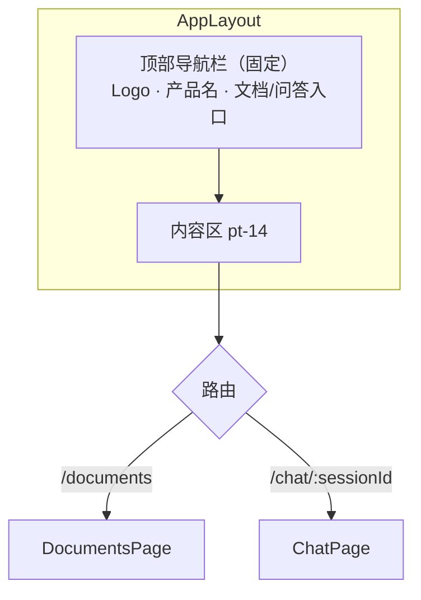
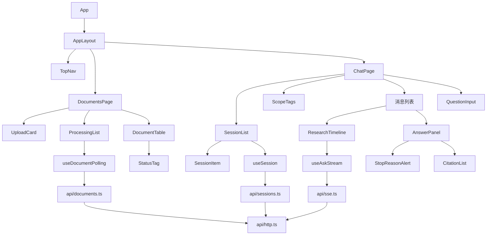
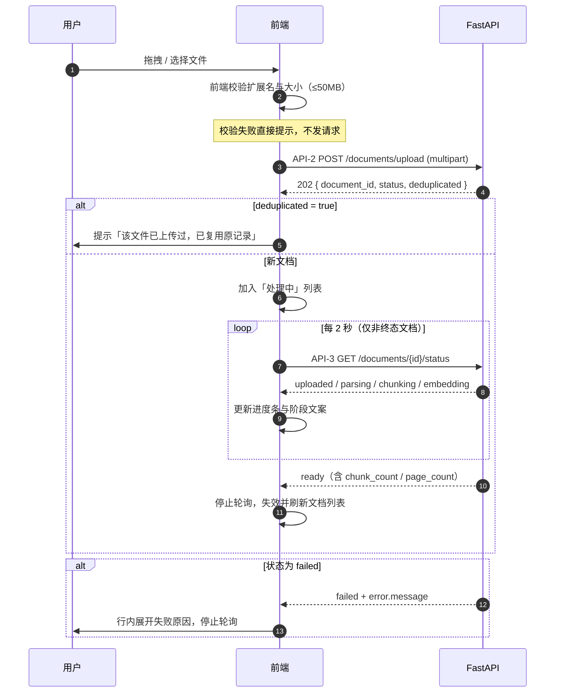
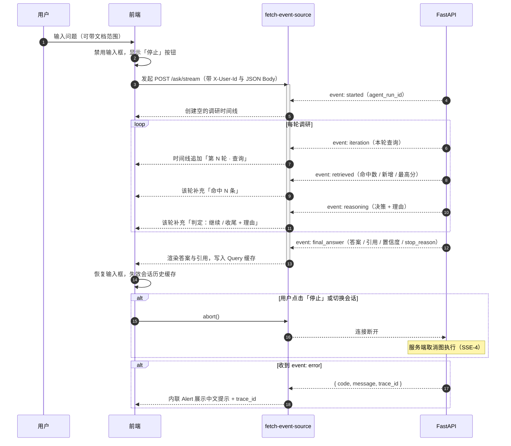
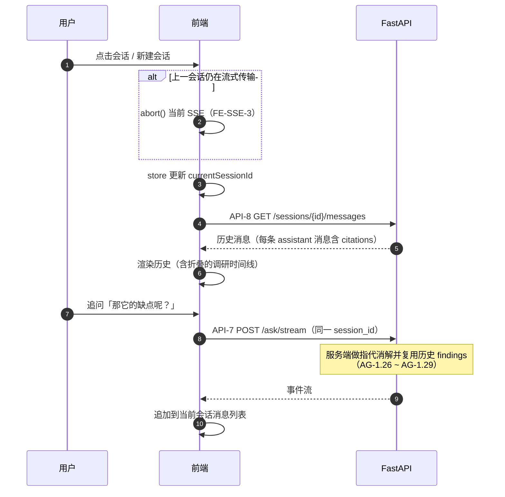

# 07 · 前端 Web 实现路线

| 项目 | 内容 |
| --- | --- |
| 文档版本 | v1.0 |
| 更新日期 | 2026-09-08 |
| 上游文档 | [README](./README.md) · [01-prd.md](./01-prd.md) · [02-architecture.md](./02-architecture.md) · [05-api-spec.md](./05-api-spec.md) |
| 关联文档 | [03-agent-design.md](./03-agent-design.md) · [04-data-model.md](./04-data-model.md) · [06-roadmap-and-risks.md](./06-roadmap-and-risks.md) |

---

## 1. 定位与范围

### 1.1 前端要解决什么

后端已经把「文档检索」变成了一个**可循环、可判断、可追踪的调研过程**（见 [03-agent-design.md](./03-agent-design.md)）。但如果只暴露 API，用户看到的仍是一个黑盒答案——他不知道系统查了什么、为什么继续查、凭什么得出这个结论。

前端的核心价值是：

> **把智能体的调研过程可视化，让答案从「可信度未知」变成「可逐步核对」。**

因此前端不只是表单加列表，重点在于把每一轮的「生成查询 → 命中切片 → 判定继续/收尾 → 理由」实时呈现出来，并把引用与原文绑定展示。

### 1.2 本次纳入范围（MVP）

| 编号 | 能力 | 对应需求 | 对应接口 |
| --- | --- | --- | --- |
| W-1 | 文档上传（拖拽 / 选择），展示格式白名单与大小限制 | [FR-1](./01-prd.md#fr-1-文档上传与格式支持) | [API-2](./05-api-spec.md#api-2-post-documentsupload) |
| W-2 | 文档处理状态实时追踪（六态），失败展示原因 | [FR-2](./01-prd.md#fr-2-文档处理状态查询) | [API-3](./05-api-spec.md#api-3-get-documentsdocument_idstatus) |
| W-3 | 文档列表、状态筛选、分页、删除（二次确认） | [FR-3](./01-prd.md#fr-3-文档列表与删除) | [API-4](./05-api-spec.md#api-4-get-documents)、[API-5](./05-api-spec.md#api-5-delete-documentsdocument_id) |
| W-4 | 选择一篇 / 多篇文档作为检索范围 | [FR-5](./01-prd.md#fr-5-文档范围限定) | — |
| W-5 | 提问并展示答案、引用、置信度、终止原因 | [FR-6](./01-prd.md#fr-6-多轮调研式检索核心差异化能力)、[FR-7](./01-prd.md#fr-7-引用与原文回跳) | [API-6](./05-api-spec.md#api-6-post-ask) |
| W-6 | **调研过程实时渲染**（SSE 时间线） | [FR-9](./01-prd.md#fr-9-调研过程可见) | [API-7](./05-api-spec.md#api-7-post-askstream) |
| W-7 | 证据不足时明确提示「未找到足够证据」 | [FR-8](./01-prd.md#fr-8-证据不足时的明确声明) | — |
| W-8 | 会话列表、新建、切换、历史消息拉取 | [FR-4](./01-prd.md#fr-4-会话管理) | [API-1](./05-api-spec.md#api-1-post-sessions)、[API-8](./05-api-spec.md#api-8-get-sessionssession_idmessages) |
| W-9 | 追问（沿用会话上下文） | [FR-10](./01-prd.md#fr-10-追问与上下文延续) | [API-7](./05-api-spec.md#api-7-post-askstream) |

### 1.3 本次明确不做

| 编号 | 不做的能力 | 原因 |
| --- | --- | --- |
| N-1 | 文档原文预览（PDF / Markdown 渲染） | 需引入 pdf.js 等重依赖，且依赖后端提供原文接口，当前接口未定义 |
| N-2 | 点击引用跳转原文并高亮定位 | 依赖 N-1；MVP 用「文件名 + 页码 + 章节 + 摘录」足以核对 |
| N-3 | 多文档冲突对比视图 | 依赖 [FR-11](./01-prd.md#fr-11-跨文档比对与冲突识别) 的结构化冲突数据；当前 `conflicts` 为字符串数组，先平铺展示 |
| N-4 | 用户注册 / 登录 / 个人中心 | 由网关统一鉴权，前端不实现（[O-7](./01-prd.md#62-明确不做out-of-scope)） |
| N-5 | 多语言、主题切换、移动端适配 | 桌面端专业工具场景优先 |

> 上述能力列入 [§12 后续规划](#12-后续规划)，待后端接口具备条件后再启动。

---

## 2. 技术选型

### 2.1 选型表

| 层次 | 选型 | 版本 | 理由 |
| --- | --- | --- | --- |
| 框架 | React | **19.2.8** | 类型系统与后端 Pydantic 契约可形成对照；生态最成熟 |
| 语言 | TypeScript | **7.0.2** | 接口字段多且嵌套深（`iterations` / `citations` / SSE 事件），类型约束收益显著 |
| 构建 | Vite | **8.2.2** | 冷启动快、HMR 好、`server.proxy` 配置简单（关键：用它规避 CORS） |
| 组件库 | Ant Design | **6.6.3** | `Upload` / `Table` / `Timeline` / `Tag` / `Alert` / `Collapse` 与本文档类界面高度契合；AntD 6 原生支持 React 19 |
| 路由 | React Router | **7.18.3** | 事实标准，声明式 API 与 v6 基本一致，支持 `/chat/:sessionId` 动态段 |
| 服务端状态 | TanStack Query | **5.102.8** | 缓存 / 失效 / 重试开箱即用，`refetchInterval` 天然适配「2 秒轮询文档状态」 |
| 客户端状态 | Zustand | **5.0.15** | 仅需承载 `currentSessionId`、`selectedDocIds` 等少量 UI 状态，不必引入 Redux |
| SSE 客户端 | `@microsoft/fetch-event-source` | **2.0.1** | **关键选型**，原因见 [§2.2](#22-关键决策为什么不能用原生-eventsource) |
| HTTP 客户端 | axios | **1.20.0** | 拦截器便于统一注入 `X-User-Id`、统一解析 `{ error }` 结构 |
| 样式辅助 | Tailwind CSS + `@tailwindcss/vite` | **4.3.3** | 仅用于 flex 布局与间距；**必须禁用 preflight**，见 [§2.4](#24-tailwind-v4-的配置差异) |
| 样式工具 | tailwind-merge / tw-animate-css | **3.6.0 / 1.4.0** | `tw-animate-css` 是 `tailwindcss-animate` 在 v4 的替代 |
| 图标 | lucide-react / react-icons | **1.42.0 / 5.7.0** | — |
| 图表 | recharts | **3.10.1** | MVP 暂无图表，先入依赖备用 |
| 时间 | dayjs | **1.11.23** | AntD 已内置，体积小 |

> 版本于 2026-09-08 用 `npm view <pkg> version` 实测确认为最新稳定版，并在 `web/package.json` 中锁定。

### 2.2 关键决策：为什么不能用原生 `EventSource`

[API-7](./05-api-spec.md#api-7-post-askstream) 是 `POST /ask/stream`，而浏览器原生 `EventSource` 有两条硬限制：

| 限制 | 后果 |
| --- | --- |
| **只支持 GET** | 无法发起 POST，也就无法携带 `question`（最长 2000 字符）与 `document_ids` 请求体 |
| **无法自定义请求头** | 而本系统**所有**接口都要求携带 `X-User-Id`（见 [05-api-spec.md §1.2](./05-api-spec.md#12-鉴权与用户标识)） |

因此原生 `EventSource` **完全不可用**。备选方案对比：

| 方案 | 支持 POST | 支持自定义头 | 成本 | 结论 |
| --- | --- | --- | --- | --- |
| `@microsoft/fetch-event-source` | ✅ | ✅ | 引入约 5 KB 依赖，社区广泛使用 | **采用** |
| 基于 `fetch` + `ReadableStream` 手写 | ✅ | ✅ | 需自行处理流式分包、`: ping` 心跳行、重连、`Last-Event-ID` | 备选 |
| 后端改提供 `GET /ask/stream` + ticket | ✅ | ❌（仍无法设头） | 破坏既有接口规范 | 不采用 |

### 2.3 SSE 接入的四条硬性要求

必须逐条落实，否则会出现「过程卡住 / 重连丢事件 / 服务端空转」等问题：

| 编号 | 要求 | 对应后端约定 |
| --- | --- | --- |
| FE-SSE-1 | 解析时**忽略**以 `:` 开头的注释行（`: ping` 心跳，每 15 秒一条），不得当作事件 | [SSE-2](./05-api-spec.md#44-传输约定) |
| FE-SSE-2 | 断线重连时携带 `Last-Event-ID` 请求头；服务端保留最近 100 个事件用于重放 | [SSE-1](./05-api-spec.md#44-传输约定) |
| FE-SSE-3 | 组件卸载、切换会话、用户点「停止」时必须 `abort()`，通知服务端取消图执行 | [SSE-4](./05-api-spec.md#44-传输约定) |
| FE-SSE-4 | 事件载荷**不含**原文全文（后端已裁剪），前端不得假设能拿到 chunk 正文 | [SSE-5](./05-api-spec.md#44-传输约定) |

### 2.4 Tailwind v4 的配置差异

Tailwind v4 与 v3 的机制完全不同，实现时必须注意：

| 差异 | v3 | v4 |
| --- | --- | --- |
| 配置文件 | `tailwind.config.js` | **无配置文件**，改用 CSS-first（`@theme`） |
| 集成方式 | postcss + autoprefixer | **`@tailwindcss/vite` 插件**（不再需要 postcss） |
| 禁用 preflight | `corePlugins: { preflight: false }` | **省略 `@import "tailwindcss/preflight.css"`** |
| 自定义主题 | JS 对象 | CSS 的 `@theme` 指令 |
| 动画插件 | `tailwindcss-animate` | `tw-animate-css` |

**禁用 preflight 的写法**（`src/index.css`）：

```css
@layer theme, base, components, utilities;
@import "tailwindcss/theme.css" layer(theme);
@import "tailwindcss/utilities.css" layer(utilities);   /* 无 preflight.css */
```

> **坑**：`@theme { }` 中的变量若未被任何工具类引用，会被 Tailwind 摇树剔除。
> 当这些变量由原生 CSS（如 `body { background: var(--color-canvas) }`）使用时，
> 必须改用 **`@theme static { }`** 强制输出，否则样式静默失效。

---

## 3. 与后端接口的映射

前端不改变任何后端接口。下表是调用场景与接口的对应关系：

| 前端场景 | 接口 | 关键字段 / 注意点 |
| --- | --- | --- |
| 新建会话 | [API-1](./05-api-spec.md#api-1-post-sessions) `POST /sessions` | 可传 `default_document_ids` 预置检索范围 |
| 上传文档 | [API-2](./05-api-spec.md#api-2-post-documentsupload) `POST /documents/upload` | `multipart/form-data`，字段名 `file`；返回 `deduplicated=true` 时需提示「文件已存在」 |
| 追踪处理进度 | [API-3](./05-api-spec.md#api-3-get-documentsdocument_idstatus) `GET /documents/{id}/status` | 2 秒轮询；`ready` / `failed` 为终态即停；`failed` 读 `error.message` |
| 文档列表 | [API-4](./05-api-spec.md#api-4-get-documents) `GET /documents` | 分页 `page` / `page_size`；按 `created_at` 倒序 |
| 删除文档 | [API-5](./05-api-spec.md#api-5-delete-documentsdocument_id) `DELETE /documents/{id}` | 返回 202，列表需标记「删除中」并延迟刷新 |
| 同步问答（兜底 / 评测） | [API-6](./05-api-spec.md#api-6-post-ask) `POST /ask` | SSE 不可用或需一次性拿全量轨迹时使用 |
| **流式问答（主链路）** | [API-7](./05-api-spec.md#api-7-post-askstream) `POST /ask/stream` | 见 [§2.3](#23-sse-接入的四条硬性要求) |
| 加载会话历史 | [API-8](./05-api-spec.md#api-8-get-sessionssession_idmessages) `GET /sessions/{id}/messages` | 按时间正序；每条 assistant 消息自带 `citations` |

**统一请求约定**

| 项 | 约定 |
| --- | --- |
| 基础路径 | `/api/v1`（通过 `VITE_API_BASE_URL` 配置，dev 下经 Vite proxy 转发） |
| 请求头 | `X-User-Id: <uuid>`，由 axios 拦截器统一注入 |
| 错误结构 | `{ "error": { "code", "message", "details", "trace_id" } }`，由拦截器统一解析为 `ApiError` |

---

## 4. 页面结构与路由

### 4.1 路由表

| 路径 | 页面 | 说明 |
| --- | --- | --- |
| `/` | 重定向到 `/documents` | — |
| `/documents` | `DocumentsPage` | 文档上传与列表管理 |
| `/chat` | 重定向到最近会话或新建会话 | 无会话时的兜底入口 |
| `/chat/:sessionId` | `ChatPage` | 问答调研主界面 |
| `*` | `NotFoundPage` | — |

### 4.2 全局布局



> 顶部导航栏使用 `fixed` 定位，内容区需设置对应的上内边距，避免被遮挡。

### 4.3 页面一：文档管理 `/documents`

```text
┌──────────────────────────────────────────────────────────────┐
│ 顶部导航：探赜 Alethix        [文档管理]  [智能问答]          │
├──────────────────────────────────────────────────────────────┤
│ ┌──────────────────────────────────────────────────────────┐ │
│ │  📄 拖拽文件到此处上传，或点击选择                        │ │
│ │     支持 PDF / Markdown / TXT，单个文件不超过 50 MB       │ │
│ └──────────────────────────────────────────────────────────┘ │
│  处理中：2026_ai_report.pdf   [████████░░] embedding          │
│                                                              │
│  文档列表                          状态筛选 [全部▾]          │
│  ┌────────────────────────────────────────────────────────┐  │
│  │ ☑ 文件名          格式   大小   状态      切片  操作    │  │
│  │ ☑ 2026_ai_report  pdf    5 MB  ● ready    235   [删除]  │  │
│  │ ☐ 合规指引        md     82 KB ● parsing   —    [删除]  │  │
│  │ ☐ damaged.pdf     pdf    1 MB  ● failed    —    [删除]  │  │
│  │      └ ⚠ 文档已损坏或为扫描件，未能提取到可检索的文本   │  │
│  └────────────────────────────────────────────────────────┘  │
│  已选 2 篇          [基于选中文档发起提问 →]                  │
└──────────────────────────────────────────────────────────────┘
```

**要点**

| 编号 | 说明 |
| --- | --- |
| FE-DOC-1 | 上传后**立即**把文件加入「处理中」列表并开始轮询，不等列表刷新 |
| FE-DOC-2 | 状态用彩色 Tag 区分六态；`failed` 行可展开查看 `error.message` |
| FE-DOC-3 | 仅对**非终态**文档轮询（2 秒），终态即停；超过 10 分钟提示处理超时 |
| FE-DOC-4 | `deduplicated=true` 时提示「该文件已上传过，已复用原记录」，不显示为错误 |
| FE-DOC-5 | 删除需二次确认；删除后行内显示「删除中」，1 秒后再刷新列表 |
| FE-DOC-6 | 勾选文档后「基于选中文档发起提问」跳转 `/chat/:sessionId` 并预填检索范围 |

### 4.4 页面二：问答调研 `/chat/:sessionId`

```text
┌──────────┬───────────────────────────────────────────────────┐
│ 会话列表 │ 检索范围： [2026_ai_report.pdf ×] [合规指引 ×] [+]│
│          ├───────────────────────────────────────────────────┤
│ [+ 新建] │                                                   │
│          │  Q: 这篇文档提到的主要风险有哪些？                 │
│ ● AI报告 │                                                   │
│   研读   │  ┌─ 调研过程 ──────────────────────────────────┐  │
│ ○ 合规   │  │ ● 第1轮 检索「文档中提到的主要风险因素」    │  │
│   问题   │  │   ├ 命中 10 条（新增 10，最高分 0.82）      │  │
│ ○ 供应链 │  │   └ 判定：继续 —— 缺少风险等级说明          │  │
│   对比   │  │ ● 第2轮 检索「风险等级 高 中 低」…          │  │
│          │  │   ├ 命中 14 条（新增 9，最高分 0.77）       │  │
│          │  │   └ 判定：收尾 —— 证据已充分                │  │
│          │  └───────────────────────────────────────────┘  │
│          │                                                   │
│          │  A: 根据文档内容，主要风险包括：                  │
│          │     1. 数据合规风险（第 3 页）…                   │
│          │     2. 供应链中断风险（第 7 页）…                 │
│          │     ┌────────────────────────────────────────┐   │
│          │     │ ⓘ 已达最大轮次，结论可能不完整          │   │
│          │     └────────────────────────────────────────┘   │
│          │     置信度 [中等]   引用 2 条 ▾                   │
│          │       · 2026_ai_report.pdf 第5页 3.2 行业风险     │
│          │         「本项目可能面临数据合规风险…」            │
│          ├───────────────────────────────────────────────────┤
│          │ [输入你的问题…                        ] [发送]    │
└──────────┴───────────────────────────────────────────────────┘
```

**要点**

| 编号 | 说明 |
| --- | --- |
| FE-CHAT-1 | 左侧会话栏展示标题 + 最后一条消息摘要 + 时间，支持新建 / 切换 / 删除 |
| FE-CHAT-2 | 顶部「检索范围」以可移除 Tag 展示，为空显示「全部文档」 |
| FE-CHAT-3 | 调研时间线**逐条渐进出现**，未完成的轮次显示加载指示 |
| FE-CHAT-4 | 依据 `stop_reason` 展示不同的提示条（见 [§9.3](#93-stop_reason-的展示文案)） |
| FE-CHAT-5 | 引用区默认折叠，展示文件名 / 页码 / 章节 / 原文摘录 |
| FE-CHAT-6 | 调研进行中输入框禁用，并显示「停止」按钮（触发 `abort()`） |
| FE-CHAT-7 | 切换会话时若上一会话仍在流式传输，必须先 `abort()`（FE-SSE-3） |

### 4.5 设计基调

整体追求**专业、克制、可信**——用户是来核对事实的，不是来消费视觉效果。

| 项 | 规范 |
| --- | --- |
| 字体 | PingFang SC；标题 20px/600，小标题 16px/500，正文 14px/400 |
| 主色 | `#2563EB`（可交互元素、调研时间线节点）；深 `#1D4ED8`，浅 `#3B82F6` |
| 背景 | 页面 `#F7F8FA`，卡片 `#FFFFFF` |
| 文字 | 主 `#1F2329`，次 `#646A73` |
| 功能色 | 成功 `#00B42A`、警告 `#FF7D00`、错误 `#F53F3F`、信息 `#2563EB` |
| 布局 | 统一使用 Flex 布局；顶部导航 `fixed`，内容区设置对应上内边距 |
| 动效 | 仅调研时间线节点使用淡入 + 轻微上移（200ms），其余保持静态 |

**状态色与六态映射**

| 状态 | 颜色 |
| --- | --- |
| `uploaded` | 默认灰 |
| `parsing` / `chunking` / `embedding` | 信息蓝 `#2563EB` |
| `ready` | 成功绿 `#00B42A` |
| `failed` | 错误红 `#F53F3F` |

---

## 5. 目录与组件划分

### 5.1 前端工程目录

前端作为独立子工程放在仓库根目录的 `web/` 下，与后端 `app/` 平级：

```text
web/
├── src/
│   ├── main.tsx                    # 入口：挂载 App、注册 QueryClientProvider / ConfigProvider
│   ├── App.tsx                     # 路由表
│   ├── pages/
│   │   ├── DocumentsPage.tsx       # 文档管理
│   │   ├── ChatPage.tsx            # 问答调研
│   │   └── NotFoundPage.tsx
│   ├── components/
│   │   ├── layout/     AppLayout.tsx · TopNav.tsx
│   │   ├── document/   UploadCard.tsx · DocumentTable.tsx · StatusTag.tsx · ProcessingList.tsx
│   │   ├── chat/       QuestionInput.tsx · ResearchTimeline.tsx · AnswerPanel.tsx · CitationList.tsx · StopReasonAlert.tsx
│   │   ├── session/    SessionList.tsx · SessionItem.tsx · ScopeTags.tsx
│   │   └── common/     ErrorBoundary.tsx · EmptyState.tsx · LoadingBlock.tsx · ErrorAlert.tsx
│   ├── hooks/
│   │   ├── useDocumentPolling.ts   # 非终态文档的状态轮询
│   │   ├── useAskStream.ts         # SSE 调研流（核心）
│   │   └── useSession.ts           # 会话列表 / 历史消息
│   ├── api/
│   │   ├── http.ts                 # axios 实例：注入 X-User-Id、统一错误解析
│   │   ├── documents.ts
│   │   ├── sessions.ts
│   │   ├── ask.ts                  # 同步问答
│   │   └── sse.ts                  # fetch-event-source 封装
│   ├── store/
│   │   └── useAppStore.ts          # Zustand：currentSessionId · selectedDocIds
│   ├── types/
│   │   ├── document.ts
│   │   ├── session.ts
│   │   ├── ask.ts
│   │   └── sse.ts
│   └── utils/
│       ├── errorMessages.ts        # 错误码 → 中文提示
│       └── format.ts               # 文件大小、时间、时长格式化
├── .env.example
├── vite.config.ts
├── tsconfig.json
└── package.json
```

> 单文件不超过 300 行；超过则按「容器组件 / 展示组件」继续拆分。

### 5.2 组件树



### 5.3 关键职责边界

| 层 | 职责 | 明确不做 |
| --- | --- | --- |
| `pages/` | 页面级布局与数据编排 | 不直接发请求，只调 hooks |
| `components/` | 纯展示 + 受控交互 | 不持有服务端数据 |
| `hooks/` | 请求、轮询、SSE、缓存逻辑 | 不写 JSX |
| `api/` | 接口调用与错误解析 | 不做业务判断 |
| `store/` | 跨页面的少量 UI 状态 | 不放服务端数据（归 TanStack Query） |
| `types/` | 由接口文档反推的类型 | 不自造字段名 |

---

## 6. 核心交互流程

### 6.1 链路一：文档上传与状态追踪



**实现要点**

| 编号 | 要点 |
| --- | --- |
| FE-F1-1 | 上传前做前端校验（扩展名、50 MB），但不能替代服务端校验（[NFR-3.3](./01-prd.md#53-安全与合规)） |
| FE-F1-2 | 轮询用 TanStack Query 的 `refetchInterval`，条件为「存在非终态文档」，终态自动停止 |
| FE-F1-3 | 轮询超过 10 分钟仍非终态，提示「处理超时，请稍后刷新」并停止（[FR-2](./01-prd.md#fr-2-文档处理状态查询) 第 4 条） |
| FE-F1-4 | 页面卸载 / 路由切换时不需特殊处理：Query 会自动清理定时器 |

### 6.2 链路二：提问与调研过程实时渲染（核心）



**实现要点**

| 编号 | 要点 |
| --- | --- |
| FE-F2-1 | 时间线按 `iteration` 分组：同一轮的 `iteration` / `retrieved` / `reasoning` 合并为一个时间线节点 |
| FE-F2-2 | 未完成的轮次显示加载指示；`final_answer` 到达后收起加载态 |
| FE-F2-3 | 收到 `final_answer` 后：写入消息列表缓存、失效会话列表（更新最后一条摘要） |
| FE-F2-4 | `abort()` 后需把已收到的部分事件保留展示，并标注「已停止」 |
| FE-F2-5 | 同步接口 [API-6](./05-api-spec.md#api-6-post-ask) 作为兜底：SSE 连续失败 2 次时自动降级为同步请求 |

### 6.3 链路三：会话切换与追问



**实现要点**

| 编号 | 要点 |
| --- | --- |
| FE-F3-1 | 历史消息中的 `iterations` 默认**折叠**，点击展开后复用同一套 `ResearchTimeline` 组件渲染 |
| FE-F3-2 | 追问时无需前端改写问题，服务端负责指代消解（[AG-1.28](./03-agent-design.md#66-追问与历史证据复用)） |
| FE-F3-3 | 新建会话后跳转 `/chat/{newSessionId}`，并沿用当前选中的文档范围 |

---

## 7. 状态管理设计

### 7.1 三类状态的归属

| 状态类型 | 存放位置 | 示例 |
| --- | --- | --- |
| **服务端数据** | TanStack Query 缓存 | 文档列表、文档状态、会话列表、会话历史消息 |
| **流式中间态** | 组件本地 `useState` | 当前调研的事件流、当前轮次、是否已结束 |
| **跨页面 UI 状态** | Zustand | `currentSessionId`、`selectedDocIds` |

**为什么流式中间态不进全局状态**：SSE 事件高频更新（每轮 3 个事件），若写入全局 store 会导致大范围重渲染，且这些中间态在 `final_answer` 到达后即被持久化数据取代，属于易失数据。

### 7.2 Query Key 设计

| 数据 | Query Key | 失效时机 |
| --- | --- | --- |
| 文档列表 | `['documents', { page, pageSize, status }]` | 上传成功、删除成功、文档变为终态 |
| 文档状态（批量轮询） | `['document-status', ids]` | 全部进入终态后停止轮询 |
| 会话列表 | `['sessions']` | 新建会话、删除会话、问答完成 |
| 会话历史消息 | `['messages', sessionId]` | 收到 `final_answer`、切换会话 |

### 7.3 轮询策略

```text
文档状态轮询
  ├── enabled: 存在 status ∉ { ready, failed } 的文档
  ├── refetchInterval: 2000 ms
  ├── refetchIntervalInBackground: false（切到后台标签页暂停，节省资源）
  └── 超时保护：单个文档追踪超过 10 分钟 → 标记「处理超时」并移出轮询集合
```

---

## 8. TS 类型定义

以下类型**直接由接口文档反推**，字段名与 [05-api-spec.md](./05-api-spec.md) 逐一对齐，禁止前端自造。

### 8.1 通用与文档

```typescript
/** 文档处理状态，见 README 状态枚举速查 */
export type DocumentStatus =
  | 'uploaded'
  | 'parsing'
  | 'chunking'
  | 'embedding'
  | 'ready'
  | 'failed';

/** 文档摘要，对应 05-api-spec.md §2.1 DocumentBrief */
export interface DocumentBrief {
  document_id: string;
  filename: string;
  status: DocumentStatus;
  source_format: 'pdf' | 'docx' | 'md' | 'txt' | 'html';
  file_size_bytes: number;
  chunk_count: number | null;
  page_count: number | null;
  created_at: string;
  ready_at: string | null;
}

/** 分页响应通用结构 */
export interface Paginated<T> {
  items: T[];
  total: number;
  page: number;
  page_size: number;
}

/** 上传响应，对应 API-2 */
export interface UploadDocumentResponse {
  document_id: string;
  filename: string;
  status: DocumentStatus;
  deduplicated: boolean;
  created_at: string;
}

/** 文档状态响应，对应 API-3 */
export interface DocumentStatusResponse {
  document_id: string;
  filename: string;
  status: DocumentStatus;
  chunk_count: number | null;
  page_count: number | null;
  updated_at: string;
  error: { code: string; message: string } | null;
}
```

### 8.2 引用与迭代

```typescript
/** 引用，对应 05-api-spec.md §2.2 Citation */
export interface Citation {
  document_id: string;
  chunk_id: string;
  filename: string;
  page: number | null;
  section: string | null;
  quote: string;
  score?: number;
}

/** 单轮迭代记录，对应 05-api-spec.md §2.3 Iteration */
export interface IterationRecord {
  iteration: number;
  queries: string[];
  retrieved_chunk_count: number;
  new_chunk_count: number;
  findings: string[];
  conflicts: string[];
  decision: 'continue' | 'answer';
  reason: string;
  missing_information?: string;
}
```

### 8.3 终止原因与 SSE 事件

```typescript
/** 终止原因，与 03-agent-design.md 的 StopReason 枚举保持一致 */
export type StopReason =
  | 'sufficient'
  | 'max_iterations_reached'
  | 'no_new_queries'
  | 'no_new_evidence'
  | 'low_relevance'
  | 'budget_exceeded'
  | 'internal_error';

export type Confidence = 'high' | 'medium' | 'low';

/** SSE 事件，字段与 05-api-spec.md §4.2 逐一对齐 */
export type ResearchEvent =
  | {
      type: 'started';
      agent_run_id: string;
      session_id: string;
      question: string;
      max_iterations: number;
    }
  | {
      type: 'iteration';
      iteration: number;
      queries: string[];
      searched_query_count: number;
    }
  | {
      type: 'retrieved';
      iteration: number;
      retrieved_chunk_count: number;
      new_chunk_count: number;
      max_score: number;
    }
  | {
      type: 'reasoning';
      iteration: number;
      decision: 'continue' | 'answer';
      reason: string;
      missing_information: string;
      findings_count: number;
      conflicts_count: number;
    }
  | {
      type: 'final_answer';
      agent_run_id: string;
      answer: string;
      confidence: Confidence;
      stop_reason: StopReason;
      iteration_count: number;
      duration_ms: number;
      token_used: number;
      citations: Citation[];
    }
  | {
      type: 'error';
      code: string;
      message: string;
      trace_id: string;
    };
```

### 8.4 会话与消息

```typescript
export interface Session {
  session_id: string;
  title: string | null;
  default_document_ids: string[];
  message_count: number;
  created_at: string;
}

export interface Message {
  message_id: string;
  role: 'user' | 'assistant';
  content: string;
  created_at: string;
  agent_run_id: string | null;
  confidence?: Confidence;
  citations?: Citation[];
}
```

### 8.5 统一错误

```typescript
export interface ApiErrorPayload {
  error: {
    code: string;
    message: string;
    details?: Record<string, unknown>;
    trace_id: string;
  };
}

/** axios 拦截器解析后抛出的错误对象 */
export class ApiError extends Error {
  code: string;
  traceId: string;
  details?: Record<string, unknown>;
  status: number;
}
```

---

## 9. 错误处理与用户体验

### 9.1 错误码 → 中文提示映射

错误码定义见 [05-api-spec.md §5](./05-api-spec.md#5-错误码表)。前端映射表（`utils/errorMessages.ts`）：

| 错误码 | 展示位置 | 用户提示 |
| --- | --- | --- |
| `4001003` | 上传区 | 不支持的文件类型，或文件超过 50 MB |
| `4001004` | 文档行内 | 文档已损坏、为空或为扫描件，未能提取到可检索的文本 |
| `4001005` | 上传区 | 文档数量已达上限（500 篇） |
| `4002001` | 全局 Alert | 操作过于频繁，请 {N} 秒后重试（读 `Retry-After`） |
| `4003001` | 提问区 | 所选文档中包含无权访问的文档，请重新选择 |
| `4003002` | 提问区 | 所选文档尚未处理完成，请等待其就绪后再提问 |
| `4003003` | 提问区 | 单次最多选择 20 篇文档 |
| `4003005` | 输入框 | 问题不能为空，且不超过 2000 字符 |
| `4041001` / `4044001` | 对应区域 | 文档 / 会话不存在或已删除 |
| `4091002` | 文档行内 | 文档正在处理中，请等待处理完成后再删除 |
| `5003001` / `5003002` | 答案区 | 回答生成失败，请稍后重试 |
| `5032001` | 全局 Alert | 模型服务暂时不可用，请稍后重试 |
| `5032002` | 全局 Alert | 检索服务暂时不可用，请稍后重试 |
| 其他 | 全局 Alert | 展示 `error.message` + 折叠的 `trace_id`（便于反馈排查） |

### 9.2 加载 / 空态 / 失败态

| 场景 | 处理 |
| --- | --- |
| 文档列表加载中 | `Table` 骨架屏 |
| 无文档 | 空态插画 + 「上传第一篇文档」引导按钮 |
| 无会话 | 空态 + 「新建会话」引导 |
| 历史消息加载中 | 消息区骨架屏 |
| 答案无引用 | 说明「未能定位到可核验的原文依据」 |
| 文档解析失败 | 表格行内展开红色 Alert，展示 `error.message` |
| 调研异常中断 | 时间线末尾展示「调研中断」，并保留已收到的部分过程 |

### 9.3 `stop_reason` 的展示文案

依据 [03-agent-design.md §5.2](./03-agent-design.md#5-终止策略与-stop_reason) 映射：

| `stop_reason` | 提示条文案 | 样式 |
| --- | --- | --- |
| `sufficient` | 不展示提示条 | — |
| `max_iterations_reached` | 已达最大调研轮次，以下结论可能不完整 | 警告橙 |
| `no_new_queries` | 已尝试的检索方向均已覆盖，以下为已获得的结论 | 信息蓝 |
| `no_new_evidence` | 继续检索未获得新的有效信息 | 信息蓝 |
| `low_relevance` | 在所选文档中未找到足够证据 | 警告橙 |
| `budget_exceeded` | 因检索规模受限，以下结论可能不完整 | 警告橙 |
| `internal_error` | 调研过程出错，请稍后重试 | 错误红 |

### 9.4 置信度展示

| `confidence` | 文案 | 颜色 |
| --- | --- | --- |
| `high` | 高 | 成功绿 |
| `medium` | 中 | 警告橙 |
| `low` | 低 | 错误红 |

---

## 10. 工程配置

### 10.1 Vite 开发代理（规避 CORS）

```typescript
// vite.config.ts 要点
server: {
  port: 5173,
  proxy: {
    '/api': {
      target: 'http://localhost:8000',
      changeOrigin: true,
      // SSE 必须关闭缓冲，否则事件会被攒批（对应 SSE-6）
      configure: (proxy) => {
        proxy.on('proxyRes', (proxyRes) => {
          if (proxyRes.headers['content-type']?.includes('text/event-stream')) {
            proxyRes.headers['cache-control'] = 'no-cache, no-transform';
            proxyRes.headers['x-accel-buffering'] = 'no';
          }
        });
      },
    },
  },
}
```

> 后端仍需配置 `CORSMiddleware` 作为兜底（生产环境前后端可能不同域）。开发期优先走 proxy，避免跨域与预检问题。

### 10.2 环境变量

`web/.env.example`：

| 变量 | 说明 | 默认值 |
| --- | --- | --- |
| `VITE_API_BASE_URL` | 后端基础路径 | `/api/v1` |
| `VITE_USER_ID` | 开发期模拟的用户 ID（生产由网关注入，前端不感知） | `00000000-0000-0000-0000-000000000001` |
| `VITE_POLL_INTERVAL_MS` | 文档状态轮询间隔 | `2000` |
| `VITE_POLL_TIMEOUT_MS` | 单个文档追踪超时 | `600000` |

> `VITE_USER_ID` 仅用于本地开发。生产环境 `X-User-Id` 由网关注入，前端**不得**保留任何身份逻辑（[NFR-3.2](./01-prd.md#53-安全与合规)）。

### 10.3 代码规范

| 工具 | 配置 |
| --- | --- |
| ESLint | `typescript-eslint` + `react-hooks` 规则 |
| Prettier | 2 空格、单引号、尾随逗号 |
| 类型检查 | `tsc --noEmit` 纳入 CI |
| 组件规范 | 单文件 ≤ 300 行；`export` 所有跨文件复用的类型与组件 |

### 10.4 与后端的联调前提

前端介入前，后端需具备：

| 依赖 | 说明 |
| --- | --- |
| 中间件就绪 | `docker compose up -d` 拉起 Qdrant / PostgreSQL / Redis |
| 接口可用 | API-1 ~ API-8 至少跑通 happy path |
| SSE 可验证 | 可用 `curl -N` 观察 `POST /ask/stream` 的事件流 |
| OpenAPI | `/docs` 可用，便于核对字段 |

---

## 11. 里程碑与工期估算

按 1 名前端工程师、全职投入估算（工作日）：

| 里程碑 | 内容 | 工期 | 交付物 | 验收标准 |
| --- | --- | --- | --- | --- |
| **F1** 脚手架与基础框架 | Vite + React + TS + AntD 初始化；路由与全局布局；axios 实例与错误解析；Vite proxy；类型定义骨架 | 3 天 | 可运行空壳，能调通一个真实接口（如 API-4） | 页面可访问；请求自动携带 `X-User-Id`；接口错误能解析为 `ApiError` 并提示 |
| **F2** 文档管理 | 上传卡片与校验；状态轮询与进度展示；列表、状态筛选、分页；删除与二次确认；去重与失败提示 | 4 天 | 文档管理页完整可用 | 上传后 2 秒内出现「处理中」；`ready` 后列表显示 `chunk_count`；`failed` 可展开原因；终态自动停止轮询 |
| **F3** 问答与调研过程 | 提问输入；`fetch-event-source` 接入；调研时间线渐进渲染；答案、引用、置信度、终止原因展示；停止按钮 | 5 天 | 问答页主链路可用 | SSE 事件按轮次正确分组；时间线随事件渐进出现；点「停止」后服务端收到断开；`final_answer` 后引用正确渲染 |
| **F4** 会话管理 | 会话列表、新建、切换、删除；历史消息加载与渲染；追问；检索范围 Tag 与文档选择联动 | 4 天 | 多会话能力完整 | 切换会话时中止上一会话的流；历史消息含引用；追问能承接上下文 |
| **F5** 打磨与联调 | 空态 / 加载 / 失败态补全；错误码中文提示全覆盖；响应式与视觉走查；端到端联调与回归 | 3 天 | 可交付版本 | 全部错误码有对应提示；无文档 / 无会话 / 无引用均有空态；与后端联调通过全部验收用例 |

**合计：19 个工作日 ≈ 4 周（1 名前端）**

与后端的关键路径关系：

| 阶段 | 后端 | 前端 |
| --- | --- | --- |
| 第 1~2 周 | M0 基础设施、M1 文档入库 | — |
| 第 3 周起 | M2 基础问答 | **F1 启动**（依赖 API 可用） |
| 第 4~5 周 | M3 多轮调研 | F1 → F2 |
| 第 6~7 周 | M4 流式与会话、M5 质量观测 | F3 → F4 |
| 第 8~9 周 | M6 生产就绪 | F5 打磨联调 |

> 前端自后端 M2 完成起介入，与后端 M3~M6 并行推进。整体关键路径约 **9~10 周**，人力配置为 **1 后端 + 1 算法 + 1 前端**。

---

## 12. 后续规划

完成 MVP 后，按价值与依赖顺序推进：

| 优先级 | 能力 | 阻塞依赖 | 说明 |
| --- | --- | --- | --- |
| P1 | **文档原文预览**（PDF / Markdown 渲染） | 后端需提供按 `document_id` 获取原文的接口 | 用 `react-pdf` 或直接渲染 Markdown |
| P1 | **点击引用跳转原文并高亮** | 依赖上一项 | 由 `chunk_id` 定位到页码与文本位置，是「可核验」体验的关键一环 |
| P2 | **多文档冲突对比视图** | `conflicts` 需结构化（当前为字符串数组） | 左右分栏展示两篇文档的分歧表述 |
| P2 | **调研过程回放** | 后端需支持按 `agent_run_id` 拉取完整轨迹 | 历史会话中回看当时的调研过程 |
| P3 | 文档预览缩略图与元信息面板 | — | — |
| P3 | 批量上传与文件夹导入 | — | — |
| P3 | 深色模式、多语言 | — | — |

> 说明：上述能力**均依赖后端接口的扩展**。前端不修改既有接口；如需新增能力，先在 `05-api-spec.md` 中补充接口定义，再排入前端迭代。
